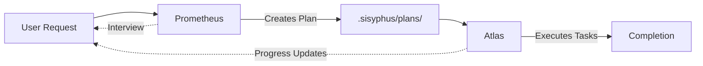

## Overview

Atlas is a todo-list orchestrator that executes planned tasks systematically through multi-agent coordination. Named after the Greek Titan who held up the celestial sphere, Atlas embodies the weight of coordination, systematic execution, and the burden of seeing work through to completion.

**Purpose**: Complete ALL tasks in a todo list until fully done, delegating to specialized agents and categories as needed.

<ParamField path="model" type="string" default="claude-sonnet-4-6">
  Balanced model for efficient orchestration
</ParamField>

<ParamField path="mode" type="string" default="all">
  Available in both primary and subagent contexts
</ParamField>

<ParamField path="temperature" type="number" default="0.1">
  Low temperature for consistent orchestration decisions
</ParamField>

## Model Configuration

### Default Model (Claude)

```json
{
  "model": "claude-sonnet-4-6",
  "temperature": 0.1
}
```

### GPT Variant

Atlas adapts to GPT models when configured:

```json
{
  "model": "gpt-5.2",
  "temperature": 0.1
}
```

### Gemini Variant

Atlas adapts to Gemini models when configured:

```json
{
  "model": "gemini-3.1-pro",
  "temperature": 0.1
}
```

## Fallback Chain

Atlas has a cost-effective fallback chain:

<ResponseField name="Primary" type="string">
  `opencode/kimi-k2.5-free`
</ResponseField>

<ResponseField name="Fallback 1" type="string">
  `anthropic/claude-sonnet-4-6`
</ResponseField>

<ResponseField name="Fallback 2" type="string">
  `openai/gpt-5.2`
</ResponseField>

<Note>
  Atlas prioritizes free models for cost efficiency during long orchestration sessions, falling back to premium models only when necessary.
</Note>

## Tool Permissions

### Allowed Tools

Atlas has full access to implementation tools:

- All file operations (read, write, edit)
- All search tools (grep, glob, ast_grep)
- LSP tools for code intelligence
- Background task management
- Todo/Task management
- Question tool for user interaction

### Blocked Tools

Atlas cannot delegate to other orchestrators to prevent infinite loops:

<ParamField path="task" type="string" default="deny">
  Cannot use task() delegation - prevents recursive orchestration
</ParamField>

<ParamField path="call_omo_agent" type="string" default="deny">
  Cannot spawn named agents - works with categories only
</ParamField>

<Warning>
  Atlas is designed to execute work directly or through category delegation, not to create additional orchestration layers. This constraint prevents delegation loops and ensures focused execution.
</Warning>

## Core Capabilities

### 1. Systematic Task Execution

Atlas works through todo lists methodically:

```markdown
## Todo List: User Authentication Implementation

- [x] Research existing auth patterns
- [x] Design JWT middleware structure  
- [ ] Implement token generation <- CURRENT
- [ ] Add token validation
- [ ] Create refresh token logic
- [ ] Add authentication to routes
- [ ] Write integration tests
- [ ] Run full verification
```

Atlas:
1. Reads current task ("Implement token generation")
2. Determines if it should work directly or delegate to category
3. Executes or delegates
4. Marks complete
5. Moves to next task
6. Repeats until all tasks done

### 2. Agent Selection & Delegation

Atlas chooses the right category for each task:

**Decision Matrix**:

| Task Type | Category | Rationale |
|-----------|----------|----------|
| UI/Frontend work | `visual-engineering` | Gemini-based, design-focused |
| Complex logic | `deep` | GPT Codex, thorough research |
| Simple fixes | `quick` | Fast, cheap Claude Haiku |
| Creative work | `artistry` | High temperature, visual focus |
| Documentation | `writing` | Optimized for prose |

```typescript
// Atlas analyzes task: "Design login form with animations"
// Decision: visual-engineering category + frontend-ui-ux skill

task(
  category="visual-engineering",
  load_skills=["frontend-ui-ux"],
  description="Implement login form UI",
  prompt="1. TASK: Create login form component with smooth animations
          2. EXPECTED OUTCOME: Responsive form with staggered reveal...
          3. REQUIRED TOOLS: write, edit, read...
          4. MUST DO: Follow existing component patterns, use Framer Motion...
          5. MUST NOT DO: Hardcode colors, use generic fonts...
          6. CONTEXT: src/components/auth/, using Tailwind + Framer Motion"
)
```

### 3. Skill Loading Strategy

Atlas automatically loads relevant skills:

```typescript
// Task mentions "commit changes"
// Atlas loads: git-master skill

task(
  category="quick",
  load_skills=["git-master"],
  description="Commit authentication changes",
  prompt="..."
)

// Task mentions "verify in browser"
// Atlas loads: playwright skill

task(
  category="visual-engineering", 
  load_skills=["frontend-ui-ux", "playwright"],
  description="Implement and verify UI",
  prompt="..."
)
```

### 4. Progress Tracking

Atlas maintains visible progress:

```markdown
## Session Progress

Completed (5/8):
✓ Research existing auth patterns
✓ Design JWT middleware structure
✓ Implement token generation
✓ Add token validation  
✓ Create refresh token logic

Current:
▶ Add authentication to routes

Pending:
◻ Write integration tests
◻ Run full verification
```

## Orchestration Process

### Phase 1: Plan Intake

Atlas reads the todo list from:
- `.sisyphus/plans/{name}.md` (Prometheus-generated)
- User-provided task list
- Inline todo creation

### Phase 2: Task Analysis

For each pending task:

1. **Parse task description**: Extract requirements
2. **Classify complexity**: Trivial, simple, moderate, complex
3. **Identify domain**: Frontend, backend, testing, infrastructure
4. **Select category**: Match domain to best category
5. **Choose skills**: Determine relevant skill loadouts

### Phase 3: Execution

Atlas decides execution strategy:

**Work directly** when:
- Task is trivial ({`<`}10 lines, single file)
- Task is reading/investigation only
- Task requires orchestration logic

**Delegate to category** when:
- Task requires specialized expertise
- Task touches multiple files
- Task has complex requirements

### Phase 4: Verification

After each task:

1. Verify deliverables exist
2. Run `lsp_diagnostics` on changed files
3. Check build status if applicable
4. Mark task complete only when verified

### Phase 5: Continuation

Atlas continues until:
- All tasks marked complete
- Verification passes on all changes
- User stops the session
- Unrecoverable error encountered

## Category Selection Logic

Atlas uses a decision tree to select categories:

```typescript
function selectCategory(task: Task): Category {
  // UI/UX work
  if (task.mentions("UI", "component", "styling", "animation")) {
    return "visual-engineering"
  }
  
  // Deep logical work
  if (task.mentions("algorithm", "architecture", "complex", "refactor")) {
    return "deep"
  }
  
  // Quick fixes
  if (task.mentions("typo", "fix", "small", "trivial")) {
    return "quick"
  }
  
  // Creative/design
  if (task.mentions("design", "creative", "prototype")) {
    return "artistry"
  }
  
  // Documentation
  if (task.mentions("docs", "README", "documentation")) {
    return "writing"
  }
  
  // Default fallback based on complexity
  return task.isComplex ? "unspecified-high" : "unspecified-low"
}
```

## Usage Examples

### Example 1: Executing Prometheus Plan

```typescript
// User previously created plan with Prometheus
// Plan saved to: .sisyphus/plans/user-authentication.md

// User invokes Atlas
/start-work user-authentication

// Atlas loads plan
"Loading plan from .sisyphus/plans/user-authentication.md

Found 3 phases with 12 tasks:
- Phase 1: Core Authentication (4 tasks)
- Phase 2: User Endpoints (3 tasks)  
- Phase 3: Testing (3 tasks)
- Verification (2 tasks)

Starting execution..."

// Phase 1, Task 1
"Working on: Create JWT token service

Analysis: Backend service implementation, moderate complexity
Category: deep (thorough implementation needed)
Skills: None required

Delegating to deep category..."

task(
  category="deep",
  load_skills=[],
  description="Implement JWT token service",
  prompt="1. TASK: Create JWT token service at src/services/auth/token.ts
          2. EXPECTED OUTCOME: Service with generate/validate/decode methods
          3. REQUIRED TOOLS: write, read, lsp_diagnostics
          4. MUST DO: Use jsonwebtoken library, handle expiry, strong secret
          5. MUST NOT DO: Hardcode secret, skip error handling
          6. CONTEXT: Express API, existing services in src/services/"
)

// After completion
"Task complete: JWT token service implemented
✓ File created: src/services/auth/token.ts
✓ lsp_diagnostics: clean
✓ Tests: 8 passed

Moving to next task..."
```

### Example 2: Mixed Task Types

```typescript
// Todo list with varied tasks
todos = [
  "Fix typo in LoginForm.tsx",
  "Implement password strength indicator with animations",
  "Write API documentation for auth endpoints",
  "Commit changes with atomic commits"
]

// Task 1: Fix typo (trivial)
Atlas: "Simple text fix - working directly"
// Makes edit, verifies, marks complete

// Task 2: Password strength UI (complex frontend)
Atlas: "UI component with animations - delegating to visual-engineering"
task(
  category="visual-engineering",
  load_skills=["frontend-ui-ux"],
  description="Password strength indicator",
  prompt="..."
)

// Task 3: Documentation (writing)
Atlas: "Documentation task - delegating to writing category"
task(
  category="writing",
  load_skills=[],
  description="API documentation",
  prompt="..."
)

// Task 4: Git commits (tool-specific)
Atlas: "Git operation - delegating with git-master skill"
task(
  category="quick",
  load_skills=["git-master"],
  description="Create atomic commits",
  prompt="..."
)
```

### Example 3: Error Recovery

```typescript
// Task fails during execution
task_result = task(category="deep", ...)
// Result: "Type error on line 45"

// Atlas: Retry with more specific instructions
Atlas: "Delegation failed - analyzing error and retrying"

task(
  session_id=task_result.session_id,  // Continue same session
  description="Fix type error",
  prompt="Previous attempt failed with type error on line 45.
          
          ERROR: Type 'string | undefined' is not assignable to type 'string'
          
          Fix: Add null check before using the value."
)

// After 3 failed attempts
Atlas: "Unable to resolve after 3 attempts. Requesting user guidance."
// Uses question tool to ask user for direction
```

## Integration with Prometheus

Atlas and Prometheus work together:



**Workflow**:

1. **User**: Requests complex feature
2. **Prometheus**: Creates detailed plan via interview
3. **Plan**: Saved to `.sisyphus/plans/{name}.md`
4. **Atlas**: Executes plan systematically
5. **Completion**: All tasks done, verified, user notified

## Configuration

Customize Atlas in `oh-my-opencode.jsonc`:

```jsonc
{
  "agents": {
    "atlas": {
      "model": "anthropic/claude-sonnet-4-6",
      "temperature": 0.1,
      "prompt_append": "Additional orchestration guidelines...",
      "disable": false,
      "color": "#10B981"
    }
  }
}
```

## Best Practices

<Check>**Work systematically** - Complete tasks in order, don't skip ahead</Check>
<Check>**Choose categories wisely** - Match task type to specialized category</Check>
<Check>**Load relevant skills** - Equip delegated agents with needed skills</Check>
<Check>**Verify each task** - Don't mark complete without evidence</Check>
<Check>**Track progress visibly** - User should see what's done and what's next</Check>

<Warning>**Never skip verification** - All changes must be validated before proceeding</Warning>
<Warning>**Never delegate orchestration** - Atlas executes, doesn't create orchestration layers</Warning>
<Warning>**Never mark incomplete** - Task complete only when fully done and verified</Warning>

## Related Agents

- [Prometheus](/api/agents/prometheus) - Creates plans that Atlas executes
- [Sisyphus](/api/agents/sisyphus) - Main orchestrator that can invoke Atlas for plan execution
- [Hephaestus](/api/agents/hephaestus) - Autonomous worker for complex individual tasks
