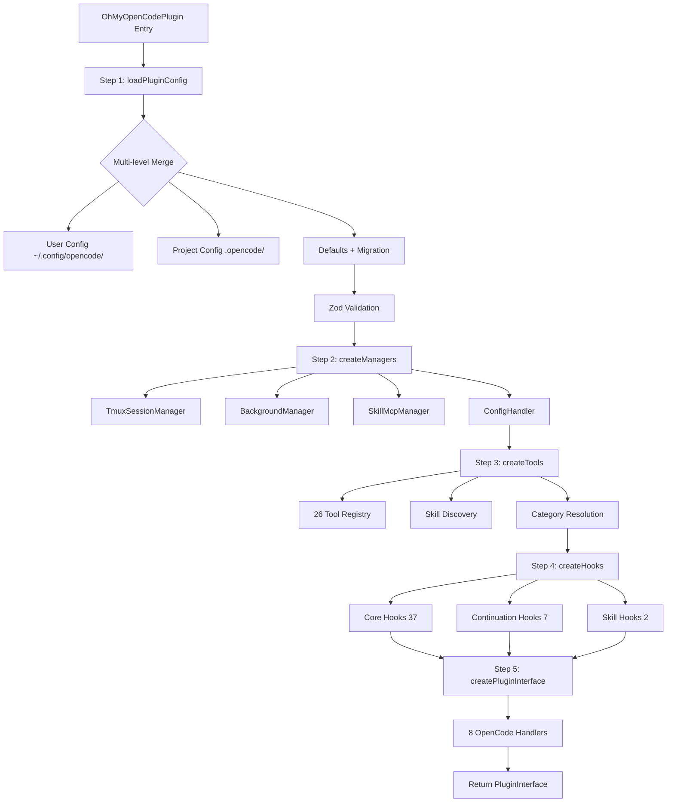

## Overview

Oh My OpenCode is an OpenCode plugin that transforms the single-agent interface into a coordinated multi-agent orchestration system. The plugin follows a strict 4-step initialization process: config → managers → tools → hooks → plugin interface.

## Plugin Entry Point

The entire plugin is exported as a single async function from `src/index.ts:16`:

```typescript
const OhMyOpenCodePlugin: Plugin = async (ctx) => {
  // 4-step initialization
  const pluginConfig = loadPluginConfig(ctx.directory, ctx)
  const managers = createManagers({ ctx, pluginConfig, ... })
  const toolsResult = await createTools({ ctx, pluginConfig, managers })
  const hooks = createHooks({ ctx, pluginConfig, ... })
  const pluginInterface = createPluginInterface({ ctx, pluginConfig, managers, hooks, tools })
  
  return pluginInterface
}
```

<Note>
OpenCode treats **all exports** as plugin instances and calls them. Only export the plugin function itself, never utility functions.
</Note>

## Four-Step Initialization

### Step 1: Config Loading

**File**: `src/plugin-config.ts`

Multi-level configuration merge with automatic migration:

```
loadPluginConfig(directory, ctx)
  1. User: ~/.config/opencode/oh-my-opencode.jsonc
  2. Project: .opencode/oh-my-opencode.jsonc
  3. mergeConfigs(user, project) → deepMerge for agents/categories
  4. Zod v4 validation → defaults for omitted fields
  5. migrateConfigFile() → legacy key transformation
```

**Merge Strategy**:
- `agents`/`categories`: Deep merge (project overrides user)
- `disabled_*` arrays: Set union (both configs combine)
- Feature configs: Project takes precedence

**Migration System** (`src/shared/migration/`):
- `agent-names.ts`: Old agent names → new (e.g., `junior` → `sisyphus-junior`)
- `hook-names.ts`: Old hook names → new
- `model-versions.ts`: Old model IDs → current versions
- `agent-category.ts`: Legacy agent configs → category system

### Step 2: Manager Creation

**File**: `src/create-managers.ts`

Four core managers handle infrastructure:

| Manager | Purpose | Key Methods |
|---------|---------|-------------|
| **TmuxSessionManager** | Terminal pane orchestration | `createSession()`, `spawnPane()`, `closePane()` |
| **BackgroundManager** | Async agent execution | `launch()`, `poll()`, `cancel()` |
| **SkillMcpManager** | Skill-embedded MCP servers | `loadSkillMcps()`, `getServerForSkill()` |
| **ConfigHandler** | OpenCode config provider | 6-phase config injection |

**ConfigHandler Phases** (`src/plugin-handlers/`):

1. **Provider Registration**: Inject available AI providers
2. **Plugin Components**: Register UI extensions
3. **Agent Registration**: Create 11+ builtin agents
4. **Tool Registration**: Expose 26 tools
5. **MCP Registration**: Load 3 built-in + skill-embedded MCPs
6. **Command Registration**: Register slash commands

### Step 3: Tool Creation

**File**: `src/create-tools.ts`

Builds three artifacts:

```typescript
const toolsResult = await createTools({ ctx, pluginConfig, managers })
// Returns:
{
  filteredTools: ToolsRecord,      // 26 registered tools
  mergedSkills: LoadedSkill[],     // Discovered skill content
  availableSkills: AvailableSkill[] // Skill metadata for prompts
}
```

**Tool Registry** (`src/plugin/tool-registry.ts`):
- 19 factory-based tools (`createXXXTool()`)
- 7 direct `ToolDefinition` objects (LSP + interactive_bash)

See [Tools Overview](/reference/tools) for complete catalog.

### Step 4: Hook Creation

**File**: `src/create-hooks.ts`

46 lifecycle hooks organized in 3 tiers:

```typescript
function createHooks() {
  const core = createCoreHooks()             // 37 hooks
  const continuation = createContinuationHooks() // 7 hooks
  const skill = createSkillHooks()           // 2 hooks
  
  return { ...core, ...continuation, ...skill }
}
```

**Core Hooks** (37 total, `src/plugin/hooks/create-core-hooks.ts`):
- **Session Hooks** (23): Model fallback, context window monitor, Ralph Loop, think mode
- **Tool Guard Hooks** (10): Comment checker, write guard, JSON recovery, hashline enhancer
- **Transform Hooks** (4): Context injector, thinking block validator, keyword detector

**Continuation Hooks** (7 total, `src/plugin/hooks/create-continuation-hooks.ts`):
- Todo continuation enforcer
- Atlas orchestration guard
- Stop continuation guard
- Background notification

**Skill Hooks** (2 total, `src/plugin/hooks/create-skill-hooks.ts`):
- Category skill reminder
- Auto slash command

<Accordion title="Hook Composition Pattern">
Every hook follows the factory pattern:

```typescript
// Hook factory
export function createContextWindowMonitor(args: { ... }) {
  return async (input, output) => {
    // Hook logic
  }
}

// Registration in create-core-hooks.ts
const contextWindowMonitor = isHookEnabled("context-window-monitor")
  ? createContextWindowMonitor({ ctx, pluginConfig })
  : undefined

return { contextWindowMonitor }
```

Hooks can be disabled via `disabled_hooks` config array.
</Accordion>

### Step 5: Plugin Interface Assembly

**File**: `src/plugin-interface.ts`

Assembles 8 OpenCode hook handlers:

```typescript
return {
  tool: tools,                                 // 26 registered tools
  "chat.params": createChatParamsHandler(),    // Anthropic effort adjustment
  "chat.headers": createChatHeadersHandler(),  // Request headers
  "chat.message": createChatMessageHandler(),  // First message variant
  "experimental.chat.messages.transform": ..., // Context injection
  "experimental.chat.system.transform": ...,   // System prompt
  config: managers.configHandler,              // 6-phase config
  event: createEventHandler(),                 // Session lifecycle
  "tool.execute.before": ...,                  // Pre-tool hooks
  "tool.execute.after": ...,                   // Post-tool hooks
}
```

## Hook System Deep Dive

### Hook Execution Points

Hooks intercept 8 lifecycle events:

| Hook Point | Fires When | Common Uses |
|------------|------------|-------------|
| `config` | Plugin load | Agent/tool/MCP registration |
| `chat.message` | User sends message | First message variant, session setup |
| `chat.params` | Before API call | Effort level adjustment |
| `event` | Session lifecycle | Created, deleted, idle, error |
| `tool.execute.before` | Before tool runs | File guards, label truncation, rules injection |
| `tool.execute.after` | After tool runs | Output truncation, metadata store |
| `messages.transform` | Before API send | Context injection, thinking block validation |
| `system.transform` | System prompt build | System directive filtering |

### Example: Ralph Loop Hook

**Purpose**: Keeps agents working until 100% task completion.

**Location**: `src/hooks/ralph-loop/`

**Registration**: `src/plugin/hooks/create-core-hooks.ts:23`

```typescript
const ralphLoop = isHookEnabled("ralph-loop")
  ? createRalphLoop({ ctx, pluginConfig })
  : undefined
```

**Hook Logic** (`src/hooks/ralph-loop/hook.ts`):

```typescript
export function createRalphLoop({ ctx, pluginConfig }) {
  return async (input, output) => {
    const session = await ctx.client.getSession(input.sessionID)
    const hasPendingTodos = checkPendingTodos(session)
    
    if (hasPendingTodos && isAgentIdle(session)) {
      // Inject continuation prompt
      output.message = {
        role: "user",
        content: "You have pending todos. Continue working."
      }
    }
  }
}
```

### Hook Disabling

Disable hooks via config:

```jsonc
{
  "disabled_hooks": [
    "ralph-loop",
    "context-window-monitor",
    "comment-checker"
  ]
}
```

<Warning>
Disabling critical hooks like `write-existing-file-guard` or `comment-checker` can lead to data loss or AI slop in outputs.
</Warning>

## Three-Tier MCP System

| Tier | Source | Management |
|------|--------|------------|
| **Built-in** | `src/mcp/` | 3 remote HTTP: websearch (Exa/Tavily), context7, grep_app |
| **Claude Code** | `.mcp.json` | `${VAR}` env expansion via claude-code-mcp-loader |
| **Skill-embedded** | SKILL.md YAML | SkillMcpManager (stdio + HTTP) |

**Built-in MCP Registration** (`src/plugin-handlers/mcps/index.ts`):

```typescript
const builtinMcps = [
  createWebSearchMcp({ apiKey: process.env.EXA_API_KEY }),
  createContext7Mcp(),
  createGrepAppMcp({ apiKey: process.env.GREP_APP_API_KEY })
]
```

**Skill MCP Example**:

From a SKILL.md file:

```yaml
mcps:
  - name: playwright
    command: npx
    args: ["@modelcontextprotocol/server-playwright"]
    env:
      PLAYWRIGHT_HEADLESS: "true"
```

The SkillMcpManager automatically launches/kills servers when skills load/unload.

## Plugin State Management

**Model Cache State** (`src/plugin-state.ts`):

```typescript
const modelCacheState = createModelCacheState()
// Stores:
{
  lastAvailableModels: Set<string>,
  lastSelectedModel: string | undefined,
  connectedProviders: string[]
}
```

Used by model fallback hooks to avoid redundant API calls.

**First Message Variant Gate** (`src/shared/first-message-variant/`):

Tracks per-session first message override:

```typescript
const firstMessageVariantGate = createFirstMessageVariantGate()
// Methods:
firstMessageVariantGate.shouldOverride(sessionID)  // Check if first msg
firstMessageVariantGate.markApplied(sessionID)     // Mark variant applied
firstMessageVariantGate.clear(sessionID)           // Session cleanup
```

## Initialization Flow Diagram



## Key Design Patterns

### Factory Pattern

All tools, hooks, and agents use factory functions:

```typescript
// Tool factory
export function createDelegateTask(options: DelegateTaskToolOptions) {
  return {
    name: "task",
    description: "Delegate work to specialized agent",
    parameters: { ... },
    execute: async (args) => { ... }
  }
}

// Agent factory
export const createSisyphusAgent: AgentFactory = (model: string) => ({
  instructions: "...",
  model,
  temperature: 0.1
})
createSisyphusAgent.mode = "primary"
```

### Barrel Exports

Each module uses `index.ts` barrel exports:

```typescript
// src/agents/index.ts
export { createSisyphusAgent } from "./sisyphus"
export { createOracleAgent } from "./oracle"
export type { AgentFactory, AgentMode } from "./types"
```

Imports use module paths:

```typescript
import { createSisyphusAgent } from "./agents"  // ✅ Barrel import
import { log } from "./shared"                  // ✅ Barrel import
```

### Safe Hook Creation

Hooks wrap in try-catch to prevent plugin crashes:

```typescript
if (safeHookEnabled) {
  return async (input, output) => {
    try {
      await hookLogic(input, output)
    } catch (e) {
      log("Hook error (non-fatal)", { error: e })
    }
  }
}
```

## Performance Considerations

### Plugin Load Timeout

OpenCode plugins have a **10-second load timeout**. The initialization must complete fast:

- Config parsing: JSONC with comments (~5ms)
- Manager creation: Sync object construction (~2ms)
- Tool creation: Async skill discovery (~50-200ms)
- Hook creation: Factory calls (~10ms)
- Total: **< 300ms typical**

<Warning>
Avoiding client API calls during init (deadlock risk). Fetch models from cache instead.
</Warning>

### Lazy Initialization

Expensive operations defer until first use:

- **Tmux sessions**: Created on first `interactive_bash` call
- **Background agents**: Launched on first `task(..., run_in_background=true)`
- **Skill MCPs**: Started when skill loads, killed when unloaded
- **LSP server**: Connects on first LSP tool call

## File Organization

Plugin follows strict directory conventions:

```
src/
├── index.ts              # Plugin entry
├── plugin-config.ts      # Config loading
├── create-managers.ts    # Manager factories
├── create-tools.ts       # Tool registry builder
├── create-hooks.ts       # Hook composition
├── plugin-interface.ts   # OpenCode handler assembly
├── agents/               # 11 agent definitions
├── hooks/                # 46 hook implementations (39 dirs + 6 files)
├── tools/                # 26 tool implementations (15 dirs)
├── features/             # 19 feature modules
├── shared/               # 100+ utilities (13 categories)
├── config/               # Zod v4 schema system
├── cli/                  # CLI commands (install, doctor, run)
├── mcp/                  # 3 built-in remote MCPs
├── plugin/               # OpenCode handler implementations
└── plugin-handlers/      # 6-phase config pipeline
```

**Conventions**:
- **kebab-case** for all files and directories
- **200 LOC soft limit** per file
- **No catch-all files** (`utils.ts`, `helpers.ts` banned)
- **Co-located tests** (`*.test.ts` next to implementation)

## Next Steps

<CardGroup cols={2}>
  <Card title="Agents" icon="users" href="/concepts/agents">
    Learn about the 11 specialized agents and their roles
  </Card>
  <Card title="Orchestration" icon="diagram-project" href="/concepts/orchestration">
    Understand agent delegation and the Intent Gate
  </Card>
  <Card title="Categories" icon="layer-group" href="/concepts/categories">
    Explore the 8 built-in task categories and model mapping
  </Card>
  <Card title="Configuration" icon="gear" href="/reference/configuration">
    Full config reference with examples
  </Card>
</CardGroup>