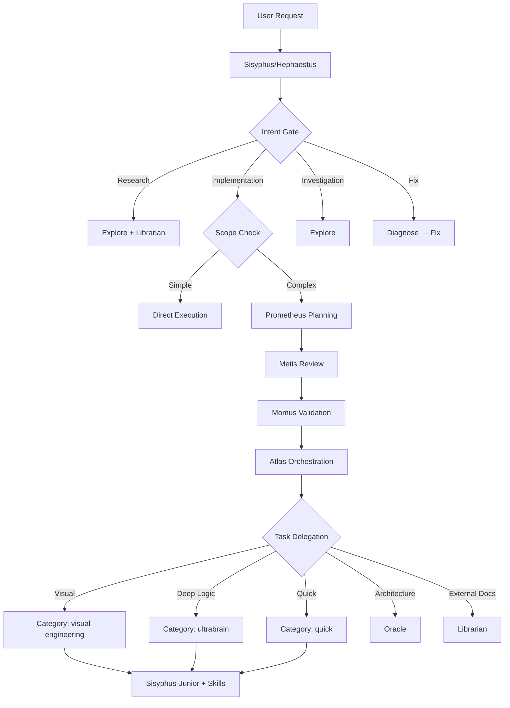
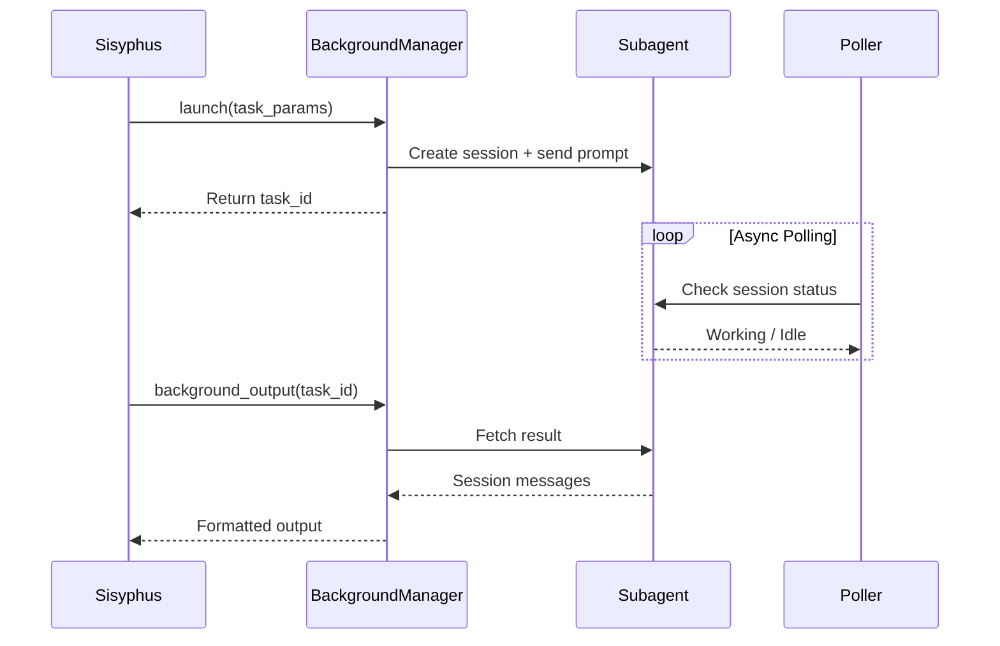

## Overview

Oh My OpenCode orchestrates specialized agents like a development team. Instead of one agent doing everything, work flows through a delegation chain based on task type, with automatic intent classification and parallel execution.

## Orchestration Flow



## The Intent Gate

**Location**: Phase 0 of Sisyphus/Hephaestus prompts

**Purpose**: Classify user intent before taking action. Prevents misinterpretation and routes to optimal handler.

### Intent Classification Table

From `src/agents/sisyphus.ts:212`:

| Surface Form | True Intent | Routing |
|--------------|-------------|----------|
| "explain X", "how does Y work" | Research/understanding | explore/librarian → synthesize → answer |
| "implement X", "add Y", "create Z" | Implementation (explicit) | plan → delegate or execute |
| "look into X", "check Y", "investigate" | Investigation | explore → report findings |
| "what do you think about X?" | Evaluation | evaluate → propose → **wait for confirmation** |
| "I'm seeing error X", "Y is broken" | Fix needed | diagnose → fix minimally |
| "refactor", "improve", "clean up" | Open-ended change | assess codebase first → propose approach |

### Intent Verbalization

**Before acting**, agents verbalize their intent classification:

```
> "I detect [research / implementation / investigation / evaluation / fix] intent — [reason]. 
   My approach: [explore → answer / plan → delegate / clarify first / etc.]."
```

**Example**:
```
User: "How does authentication work in this app?"

Sisyphus: "I detect research intent — you're asking for understanding, not implementation.
My approach: launch explore to find auth files → synthesize findings → explain."

[Fires explore agent in background]
```

### Request Type Classification

From `src/agents/sisyphus.ts:229`:

- **Trivial** (single file, known location) → Direct tools only
- **Explicit** (specific file/line, clear command) → Execute directly
- **Exploratory** ("How does X work?", "Find Y") → Fire explore (1-3) + tools in parallel
- **Open-ended** ("Improve", "Refactor", "Add feature") → Assess codebase first
- **Ambiguous** (unclear scope) → Ask ONE clarifying question

### Ambiguity Check

**Must ask** when:
- Multiple interpretations with 2x+ effort difference
- Missing critical info (file, error, context)
- User's design seems flawed or suboptimal

**Can proceed** when:
- Single valid interpretation
- Multiple interpretations, similar effort (choose reasonable default, note assumption)

## Delegation Mechanisms

### Two Delegation Tools

| Tool | Purpose | Use Case |
|------|---------|----------|
| `call_omo_agent` | Invoke specific named agent | Oracle, Librarian, Explore, Hephaestus |
| `task` | Delegate by category OR agent | Category-based routing with skills |

### call_omo_agent: Named Agent Invocation

**File**: `src/tools/call-omo-agent/tools.ts`

**Parameters**:
```typescript
{
  description: string          // Brief task description
  prompt: string               // Full instructions to agent
  subagent_type: string        // Agent name (oracle, librarian, explore, etc.)
  run_in_background?: boolean  // Async execution (default: false)
  session_id?: string          // Resume existing session
}
```

**Example**: Consulting Oracle for architecture advice

```typescript
call_omo_agent(
  description="Get architectural advice on state management",
  subagent_type="oracle",
  prompt="I need advice on state management architecture. Context: \n- React app with 20+ components\n- Currently using prop drilling\n- Considering Redux vs Context API\n\nWhat do you recommend?"
)
```

**Background Execution**:

```typescript
// Launch 3 research tasks in parallel
call_omo_agent(description="Explore auth patterns", subagent_type="explore", run_in_background=true, ...)
call_omo_agent(description="Research OAuth docs", subagent_type="librarian", run_in_background=true, ...)
call_omo_agent(description="Check security best practices", subagent_type="librarian", run_in_background=true, ...)

// Poll results later
background_output(task_id=1)
background_output(task_id=2)
background_output(task_id=3)
```

### task: Category-Based Delegation

**File**: `src/tools/delegate-task/tools.ts`

**Parameters**:
```typescript
{
  description: string           // Brief task description
  prompt: string                // Full instructions
  category?: string             // Task category (visual-engineering, ultrabrain, quick, etc.)
  subagent_type?: string        // Explicit agent (alternative to category)
  load_skills?: string[]        // Skills to inject
  run_in_background?: boolean   // Async execution
  session_id?: string           // Resume session
  command?: string              // Auto-run bash command after
}
```

**Category-Based Example**:

```typescript
task(
  description="Implement responsive navbar",
  category="visual-engineering",
  load_skills=["playwright", "tailwind"],
  prompt="Create a responsive navbar with:\n- Logo on left\n- Nav links center\n- Mobile hamburger menu\n- Smooth transitions\n\nMatch existing design system."
)
```

This spawns **Sisyphus-Junior** with:
- Model: `gemini-3.1-pro` (visual-engineering default)
- Skills: Playwright + Tailwind documentation injected
- Category prompt: Design-first mindset, bold aesthetics

**Subagent-Type Example**:

```typescript
task(
  description="Deep refactor of state management",
  subagent_type="hephaestus",
  prompt="GOAL: Refactor state management to use Zustand.\n\nExplore current implementation, migrate incrementally, maintain tests."
)
```

This invokes **Hephaestus** directly (GPT-5.3-codex autonomous mode).

## Delegation Decision Tree

From `src/agents/sisyphus.ts:251`:

```
1. Is there a specialized agent that perfectly matches this request?
   YES → call_omo_agent(subagent_type="...")
   NO → Continue

2. Is there a category that best describes this task?
   YES → task(category="...", load_skills=[...])
   NO → Continue

3. Can I do it myself for the best result, FOR SURE?
   YES → Execute directly
   NO → Default to task(category="unspecified-low" or "unspecified-high")

**Default Bias: DELEGATE. Work yourself only when it's super simple.**
```

## Prometheus Planning Mode

**Activation**: Press **Tab** in OpenCode, or `@plan "your task"`

**File**: `src/agents/prometheus/interview-mode.ts`

### Interview-Based Planning

**Workflow**:

1. **Context Gathering**:
   ```typescript
   call_omo_agent(description="Explore codebase patterns", subagent_type="explore", run_in_background=true, ...)
   call_omo_agent(description="Research documentation", subagent_type="librarian", run_in_background=true, ...)
   ```

2. **User Request Summary**:
   - Concise restatement of requirements
   - List of uncertainties and ambiguities
   - Clarifying questions

3. **Iteration Until Clarity**:
   - User answers questions
   - Prometheus refines understanding
   - Loop until 100% clear

4. **Plan Generation**:
   - Task dependency graph
   - Parallel execution waves
   - Category + skills recommendations
   - Actionable TODO list

5. **Review Pipeline**:
   - **Metis** (gap analyzer): Surfaces missed requirements
   - **Momus** (validator): Reviews plan quality

### Plan Output Requirements

From `src/tools/delegate-task/constants.ts:249`:

**MANDATORY SECTIONS**:

#### 1. Task Dependency Graph

```markdown
## Task Dependency Graph

| Task | Depends On | Reason |
|------|------------|--------|
| Task 1 | None | Starting point |
| Task 2 | Task 1 | Requires Task 1 output |
| Task 3 | Task 1 | Uses Task 1 foundation |
| Task 4 | Task 2, Task 3 | Integrates both |
```

#### 2. Parallel Execution Graph

```markdown
## Parallel Execution Graph

Wave 1 (Start immediately):
├── Task 1: Setup database schema (no dependencies)
└── Task 5: Design UI mockups (no dependencies)

Wave 2 (After Wave 1 completes):
├── Task 2: Implement API endpoints (depends: Task 1)
├── Task 3: Write migrations (depends: Task 1)
└── Task 6: Build UI components (depends: Task 5)

Wave 3 (After Wave 2 completes):
└── Task 4: Integration tests (depends: Task 2, Task 3)

Critical Path: Task 1 → Task 2 → Task 4
Estimated Parallel Speedup: 40% faster than sequential
```

#### 3. Category + Skills Recommendations

```markdown
### Task 2: Implement API endpoints

**Delegation Recommendation:**
- Category: `ultrabrain` - Complex business logic, requires deep reasoning
- Skills: [`express-api`, `database-patterns`] - API framework + DB best practices

**Skills Evaluation:**
- INCLUDED `express-api`: Task uses Express, needs routing/middleware patterns
- INCLUDED `database-patterns`: Task involves ORM usage, transaction handling
- OMITTED `playwright`: No UI testing in this task
```

#### 4. Actionable TODO List

```markdown
## TODO List (ADD THESE)

### Wave 1 (Start Immediately)

- [ ] **1. Setup database schema**
  - What: Create tables for users, posts, comments with proper indexes
  - Depends: None
  - Blocks: 2, 3
  - Category: `ultrabrain`
  - Skills: [`database-patterns`]
  - QA: Run `npm run migrate` and verify tables exist

### Wave 2 (After Wave 1)

- [ ] **2. Implement API endpoints**
  - What: Create CRUD routes for /api/users, /api/posts
  - Depends: 1
  - Blocks: 4
  - Category: `ultrabrain`
  - Skills: [`express-api`, `database-patterns`]
  - QA: `npm test -- api.test.ts` passes
```

## Atlas Orchestration

**Activation**: Run `/start-work` after creating a Prometheus plan

**File**: `src/agents/atlas/agent.ts`

### Execution Workflow

1. **Load TODOs**: Read task list from session

2. **Identify Wave 1**: Find all tasks with no dependencies

3. **Parallel Dispatch**:
   ```typescript
   // Fire all Wave 1 tasks in parallel
   task(category="ultrabrain", load_skills=["database-patterns"], ...)
   task(category="visual-engineering", load_skills=["playwright"], ...)
   ```

4. **Accumulate Learnings**:
   - Conventions discovered in Task 1 passed to Task 5
   - Mistakes made early aren't repeated
   - System gets smarter as it works

5. **Independent Verification**:
   - Each task has QA criteria
   - Atlas verifies completion independently
   - Marks task complete only after QA passes

6. **Wave Progression**: Move to Wave 2 after Wave 1 completes

7. **Final Verification**: Run all QA criteria after completion

### Model-Specific Prompts

Atlas has optimized prompts per model family:

- **GPT models** (`src/agents/atlas/gpt.ts`): Explicit reasoning steps, principle-driven
- **Gemini models** (`src/agents/atlas/gemini.ts`): Concrete examples, visual cues
- **Claude models** (`src/agents/atlas/default.ts`): Instruction-following, structured output

**Routing** (`src/agents/atlas/agent.ts:39`):
```typescript
function getAtlasPromptSource(model?: string): AtlasPromptSource {
  if (model && isGptModel(model)) return "gpt"
  if (model && isGeminiModel(model)) return "gemini"
  return "default"
}
```

## Background Execution

**Manager**: `src/features/background-agent/manager.ts`

**Concurrency Limit**: 5 concurrent tasks per model/provider

### Background Task Flow



### Background vs Sync

| Mode | When to Use | Example |
|------|-------------|----------|
| **Background** (`run_in_background=true`) | Parallel research, non-blocking work | explore + librarian simultaneously |
| **Sync** (`run_in_background=false`) | Sequential tasks needing immediate result | Oracle consultation before proceeding |

**Background Example**:

```typescript
// Launch 3 tasks in parallel
const explore_id = call_omo_agent(..., run_in_background=true)
const librarian_id = call_omo_agent(..., run_in_background=true)
const oracle_id = call_omo_agent(..., run_in_background=true)

// Continue other work while they run
read("src/auth.ts")
grep("OAuth", ".")

// Collect results
const explore_result = background_output(task_id=explore_id)
const librarian_result = background_output(task_id=librarian_id)
const oracle_result = background_output(task_id=oracle_id)

// Synthesize findings
```

**Sync Example**:

```typescript
// Need immediate architectural guidance before proceeding
const advice = call_omo_agent(
  subagent_type="oracle",
  run_in_background=false,  // Block until complete
  prompt="Should I use Redux or Context API?"
)

// Proceed based on advice
if (advice.includes("Redux")) {
  // Install Redux
} else {
  // Use Context API
}
```

## Skill Loading

**Manager**: `src/features/opencode-skill-loader/`

**Purpose**: Inject specialized knowledge into delegated agents

### Skill Discovery

Skills loaded from:
1. **Built-in skills** (`src/features/builtin-skills/skills/`)
2. **OpenCode skills** (`~/.config/opencode/skills/`)
3. **Project skills** (`.opencode/skills/`)

### Skill Structure

**SKILL.md format**:

```markdown
---
name: playwright
description: Playwright browser automation patterns
---

# Playwright Skill

## Common Patterns

[Skill content here]

## Anti-Patterns

[What to avoid]
```

### Skill Injection

When you delegate with `load_skills=["playwright", "tailwind"]`:

1. **Skill content extracted** from SKILL.md files
2. **Injected into system prompt**:
   ```
   <loaded_skills>
   ## playwright
   [Full skill content]
   
   ## tailwind
   [Full skill content]
   </loaded_skills>
   ```
3. **Agent has context** for specialized task

**Example**:

```typescript
task(
  category="visual-engineering",
  load_skills=["playwright", "tailwind"],
  prompt="Write E2E test for login flow"
)
```

Spawned agent receives:
- Gemini 3 Pro model (visual-engineering default)
- Playwright skill: Browser automation patterns
- Tailwind skill: Styling conventions
- Category prompt: Design-first mindset

## Codebase Assessment

**Phase**: Phase 1 of Sisyphus/Hephaestus prompts (for open-ended tasks)

**File**: `src/agents/sisyphus.ts:275`

### Quick Assessment

1. Check config files (linter, formatter, type config)
2. Sample 2-3 similar files for consistency
3. Note project age signals (dependencies, patterns)

### State Classification

| State | Indicators | Action |
|-------|-----------|--------|
| **Disciplined** | Consistent patterns, configs present, tests exist | Follow existing style strictly |
| **Transitional** | Mixed patterns, some structure | Ask: "I see X and Y. Which to follow?" |
| **Legacy/Chaotic** | No consistency, outdated patterns | Propose: "No clear conventions. I suggest X. OK?" |
| **Greenfield** | New/empty project | Apply modern best practices |

**Important**: Verify before assuming chaos:
- Different patterns may serve different purposes (intentional)
- Migration might be in progress
- You might be looking at wrong reference files

## Ralph Loop: The Discipline Hook

**File**: `src/hooks/ralph-loop/hook.ts`

**Purpose**: Prevents agents from stopping mid-task. Yanks them back to work if idle with pending todos.

**Hook Point**: `chat.message` (continuation detection)

**Logic**:

```typescript
if (hasPendingTodos && isAgentIdle) {
  injectContinuationPrompt(
    "You have pending todos. Continue working until ALL are completed."
  )
}
```

**Named After**: Ralph from the novel *Infinite Jest* - character who never stops working.

**Disable**: Add `"ralph-loop"` to `disabled_hooks` if you want agents to stop when they think they're done.

## Todo vs Task System

**Configuration**: `use_task_system` (default: false, uses todos)

### Todo System (Default)

**Tool**: `TodoWrite`

**Format**: Simple markdown checklist

```markdown
- [ ] Setup database schema
- [ ] Implement API endpoints
- [ ] Write tests
```

**Pros**: Simple, lightweight, markdown-native

**Cons**: No dependency tracking, limited metadata

### Task System (Opt-In)

**Tools**: `TaskCreate`, `TaskUpdate`, `TaskGet`, `TaskList`

**Format**: Structured task objects with dependencies

```typescript
TaskCreate(
  subject="Setup database schema",
  description="Create tables for users, posts, comments",
  blockedBy=[],
  blocks=["task-2", "task-3"],
  metadata={ category: "ultrabrain", skills: ["database-patterns"] }
)
```

**Pros**: Dependency tracking, metadata, parallel wave identification

**Cons**: More verbose, requires explicit task management

**Recommendation**: Use task system for complex multi-day projects. Stick with todos for simple work.

## Orchestration Anti-Patterns

### Over-Delegation

**Problem**: Delegating trivial tasks that are faster to do directly

**Example**:
```typescript
// ❌ BAD
task(category="quick", prompt="Add a console.log statement to line 42")

// ✅ GOOD
edit(file="src/app.ts", oldString="function foo() {", newString="function foo() {\n  console.log('debug');")
```

**Rule**: If you know the exact file, line, and change, use direct tools.

### Under-Delegation

**Problem**: Doing complex work yourself when a specialist exists

**Example**:
```typescript
// ❌ BAD
// Sisyphus tries to design UI itself

// ✅ GOOD
task(
  category="visual-engineering",
  load_skills=["design-system"],
  prompt="Design responsive card component matching existing patterns"
)
```

**Rule**: Delegate when specialist category or agent exists.

### Sync-Only Execution

**Problem**: Running research tasks sequentially instead of parallel

**Example**:
```typescript
// ❌ BAD (serial, 30s total)
const explore = call_omo_agent(subagent_type="explore", ...)
const librarian = call_omo_agent(subagent_type="librarian", ...)

// ✅ GOOD (parallel, 10s total)
call_omo_agent(subagent_type="explore", run_in_background=true, ...)
call_omo_agent(subagent_type="librarian", run_in_background=true, ...)
background_output(task_id=1)
background_output(task_id=2)
```

**Rule**: Use background execution for independent research tasks.

### Missing Skills

**Problem**: Delegating without loading relevant skills

**Example**:
```typescript
// ❌ BAD
task(category="visual-engineering", prompt="Write Playwright test")

// ✅ GOOD
task(
  category="visual-engineering",
  load_skills=["playwright", "testing-patterns"],
  prompt="Write Playwright test"
)
```

**Rule**: Always evaluate available skills and justify inclusions/omissions.

## Next Steps

<CardGroup cols={2}>
  <Card title="Categories" icon="layer-group" href="/concepts/categories">
    Learn about the 8 task categories and model mapping
  </Card>
  <Card title="Agents" icon="users" href="/concepts/agents">
    Deep dive into all 11 agents and their capabilities
  </Card>
  <Card title="Configuration" icon="gear" href="/reference/configuration">
    Customize delegation behavior and model assignments
  </Card>
  <Card title="Skills" icon="book" href="/reference/skills">
    Browse available skills and create custom ones
  </Card>
</CardGroup>