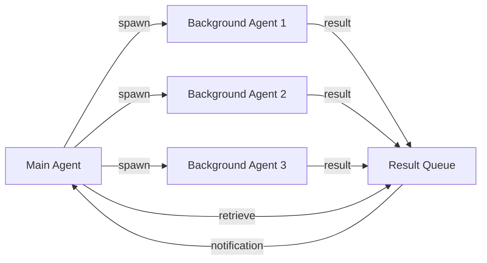

## Overview

Background agents let you run multiple specialized agents simultaneously. While one agent writes code, another researches patterns, another checks documentation—like having a full development team.

<Tip>
Background execution is the secret weapon that makes Oh My OpenCode feel 10x faster than traditional single-threaded AI assistants.
</Tip>

## Quick Start

<Steps>
<Step title="Launch background agent">
```typescript
task(
  category="deep",
  prompt="Analyze authentication patterns in the codebase",
  run_in_background=true
)
```
</Step>

<Step title="Continue working">
The agent runs in the background. You (or the main agent) can continue other work immediately.
</Step>

<Step title="Retrieve results">
```typescript
background_output(task_id="bg_abc123")
```
Or wait for automatic notification when complete.
</Step>
</Steps>

## How Background Agents Work

### Architecture



### Lifecycle

<Steps>
<Step title="Pending">
Task created, waiting for concurrency slot
</Step>

<Step title="Running">
Agent actively working on task
</Step>

<Step title="Completion">
Task finishes with one of:
- ✅ **completed** - Successful completion
- ❌ **error** - Failed with error
- ⏹️ **cancelled** - Manually cancelled
- 🛑 **interrupt** - Stale timeout (180s no activity)
</Step>
</Steps>

## Using Background Agents

### The `task()` Tool

```typescript
task(
  category: string,              // "deep", "quick", "visual-engineering", etc.
  prompt: string,                 // Detailed task description
  run_in_background: boolean,     // Set to true for background
  load_skills?: string[],         // Optional skills to load
  subagent_type?: string          // Override with specific agent
)
```

<CodeGroup>
```typescript Research Tasks
// Deep codebase analysis
task(
  category="deep",
  prompt="Find all authentication flows and document patterns",
  run_in_background=true
)

// Documentation lookup
task(
  subagent_type="librarian",
  prompt="Search for OAuth 2.0 PKCE examples in official docs",
  run_in_background=true
)

// Pattern exploration
task(
  subagent_type="explore",
  prompt="Find all error handling patterns used in services/",
  run_in_background=true
)
```

```typescript Implementation Tasks
// Quick fixes in parallel
task(
  category="quick",
  prompt="Fix linting errors in src/utils/",
  run_in_background=true
)

task(
  category="quick",
  prompt="Update import paths in src/components/",
  run_in_background=true
)

// UI work
task(
  category="visual-engineering",
  load_skills=["frontend-ui-ux"],
  prompt="Create responsive card component with hover states",
  run_in_background=true
)
```
</CodeGroup>

### Retrieving Results

```typescript
// Get result by task ID
background_output(task_id="bg_abc123")

// Cancel running task
background_cancel(task_id="bg_abc123")
```

<Warning>
Retrieve results promptly. Background task data is cleared after retrieval.
</Warning>

## Concurrency Management

By default, Oh My OpenCode allows 5 concurrent tasks per provider/model. This prevents overwhelming API rate limits.

### Default Limits

```json
{
  "background_task": {
    "defaultConcurrency": 5,
    "staleTimeoutMs": 180000  // 3 minutes
  }
}
```

### Per-Provider Limits

```json
{
  "background_task": {
    "providerConcurrency": {
      "anthropic": 3,    // Limit expensive providers
      "openai": 3,
      "opencode": 10,    // Allow more for cheap/free providers
      "zai-coding-plan": 10
    }
  }
}
```

### Per-Model Limits

```json
{
  "background_task": {
    "modelConcurrency": {
      "anthropic/claude-opus-4-6": 2,   // Very limited for expensive models
      "opencode/gpt-5-nano": 20         // Allow many for cheap models
    }
  }
}
```

**Priority order:** `modelConcurrency` > `providerConcurrency` > `defaultConcurrency`

## Visual Monitoring with Tmux

See background agents work in real-time using tmux integration.

### Setup

<Steps>
<Step title="Enable tmux in config">
```json
{
  "tmux": {
    "enabled": true,
    "layout": "main-vertical",
    "main_pane_size": 60,
    "main_pane_min_width": 120,
    "agent_pane_min_width": 40
  }
}
```
</Step>

<Step title="Run OpenCode in tmux">
```bash
# Start tmux session
tmux new -s dev

# Run OpenCode with port
opencode --port 3000
```
</Step>

<Step title="Watch agents spawn">
When background agents run, new panes appear automatically:

```
┌─────────────────────┬──────────────┐
│                     │              │
│   Main Agent        │  Explore #1  │
│   (Sisyphus)        │              │
│                     ├──────────────┤
│                     │              │
│                     │  Librarian   │
│                     │              │
└─────────────────────┴──────────────┘
```
</Step>
</Steps>

### Layout Options

| Layout | Description | Best For |
|--------|-------------|----------|
| `main-vertical` | Main pane left, agents stack right | Wide monitors, many agents |
| `main-horizontal` | Main pane top, agents stack bottom | Standard monitors |
| `tiled` | Equal-size grid | Few agents (2-4) |
| `even-horizontal` | Equal columns | Comparing agents side-by-side |
| `even-vertical` | Equal rows | Stacking sequential work |

### Minimum Sizes

```json
{
  "tmux": {
    "main_pane_size": 60,           // Main pane % (20-80)
    "main_pane_min_width": 120,     // Minimum columns for main
    "agent_pane_min_width": 40      // Minimum columns per agent
  }
}
```

If terminal is too small, agents run without visual panes (background mode continues to work).

## Real-World Patterns

### Pattern 1: Research While Building

```typescript
// Fire research agents immediately
const authPatterns = task(
  subagent_type="explore",
  prompt="Find all auth implementations in the codebase",
  run_in_background=true
)

const oauthDocs = task(
  subagent_type="librarian",
  prompt="Find OAuth 2.0 best practices and examples",
  run_in_background=true
)

// Start implementation with what we know
// Incorporate research results as they arrive
```

### Pattern 2: Parallel Implementation

```typescript
// Split work across multiple agents
const frontend = task(
  category="visual-engineering",
  load_skills=["frontend-ui-ux"],
  prompt="Build the dashboard UI",
  run_in_background=true
)

const backend = task(
  category="deep",
  prompt="Implement the dashboard API endpoints",
  run_in_background=true
)

const tests = task(
  category="quick",
  prompt="Write integration tests for dashboard",
  run_in_background=true
)

// Wait for all to complete
```

### Pattern 3: Massive Exploration

```typescript
// Fire 10+ explore agents to map the codebase
const areas = [
  "authentication flows",
  "database schemas",
  "API routes",
  "test patterns",
  "error handling",
  "configuration",
  "build process",
  "deployment scripts"
]

areas.forEach(area => {
  task(
    subagent_type="explore",
    prompt=`Analyze ${area} in the codebase`,
    run_in_background=true
  )
})
```

<Note>
With proper concurrency limits, this pattern is safe and effective for rapid codebase understanding.
</Note>

### Pattern 4: Verification Pipeline

```typescript
// Sequential but parallel verification
task(
  category="quick",
  prompt="Run linter and fix auto-fixable issues",
  run_in_background=true
)

task(
  category="quick",
  prompt="Run type checker and report errors",
  run_in_background=true
)

task(
  category="quick",
  prompt="Run tests and report failures",
  run_in_background=true
)
```

## Advanced: Background Notifications

Get OS notifications when background tasks complete.

### Automatic Notifications

Enabled by default via `background-notification` hook:

```
┌─────────────────────────────┐
│ Background Task Complete    │
│ ────────────────────────    │
│ explore (2.3s)              │
│ Found 15 auth patterns      │
└─────────────────────────────┘
```

### Configuration

```json
{
  "notification": {
    "force_enable": true  // Force enable even with other notification plugins
  },
  "disabled_hooks": [
    // "background-notification"  // Disable if unwanted
  ]
}
```

## Stale Task Handling

Tasks with no activity for 180 seconds are marked as **interrupt**.

```json
{
  "background_task": {
    "staleTimeoutMs": 180000  // 3 minutes (minimum: 60000)
  }
}
```

**Why this matters:**
- Prevents hung agents from blocking concurrency slots
- Automatically recovers from stuck tool calls
- Allows retry without manual intervention

## Debugging Background Tasks

### View All Active Tasks

```typescript
// In the main session
"What background tasks are running?"
```

The agent can introspect its own background task queue.

### Check Task Status

Logs are written to `/tmp/oh-my-opencode.log`:

```bash
tail -f /tmp/oh-my-opencode.log | grep background
```

### Common Issues

<AccordionGroup>
<Accordion title="Task stuck in 'pending' state">
**Cause:** Concurrency limit reached.

**Solution:** Wait for other tasks to complete, or increase limits:
```json
{
  "background_task": {
    "providerConcurrency": { "anthropic": 5 }
  }
}
```
</Accordion>

<Accordion title="Task marked as 'interrupt'">
**Cause:** No activity for 180 seconds.

**Solution:** 
- Check logs for hung tool calls
- Increase timeout if task legitimately needs more time:
```json
{
  "background_task": {
    "staleTimeoutMs": 300000  // 5 minutes
  }
}
```
</Accordion>

<Accordion title="Background agent using wrong model">
**Cause:** Category not configured.

**Solution:** Set category model explicitly:
```json
{
  "categories": {
    "deep": { "model": "openai/gpt-5.3-codex" }
  }
}
```
</Accordion>
</AccordionGroup>

## Best Practices

<CardGroup cols={2}>
<Card title="Do: Spawn early" icon="rocket">
Fire background agents immediately, don't wait until you need results.

```typescript
// ✅ Good
task(..., run_in_background=true)
// Start other work

// ❌ Bad
// Do everything sequentially
// Then spawn agent
```
</Card>

<Card title="Do: Use cheap models" icon="dollar-sign">
Background exploration doesn't need Opus-level intelligence.

```json
{
  "agents": {
    "explore": { "model": "github-copilot/grok-code-fast-1" }
  }
}
```
</Card>

<Card title="Don't: Wait unnecessarily" icon="clock">
Let background agents complete naturally.

```typescript
// ❌ Bad
task(..., run_in_background=true)
wait_for_completion()  // Don't do this

// ✅ Good
task(..., run_in_background=true)
// Continue work, check results when needed
```
</Card>

<Card title="Don't: Ignore concurrency" icon="users">
Setting limits too high overwhelms APIs.

```json
// ❌ Bad
{ "defaultConcurrency": 50 }

// ✅ Good
{ 
  "providerConcurrency": {
    "anthropic": 3,
    "opencode": 10
  }
}
```
</Card>
</CardGroup>

## Related

<CardGroup cols={2}>
<Card title="Ultrawork Mode" icon="bolt" href="/guides/ultrawork-mode">
Automatic parallel agent spawning
</Card>

<Card title="Agent Model Matching" icon="microchip" href="/guides/agent-model-matching">
Choose the right model for each agent
</Card>

<Card title="Categories" icon="layer-group" href="/guides/custom-categories">
Domain-specific agent presets
</Card>

<Card title="Prometheus Planning" icon="map" href="/guides/prometheus-planning">
Strategic planning with parallel execution
</Card>
</CardGroup>
