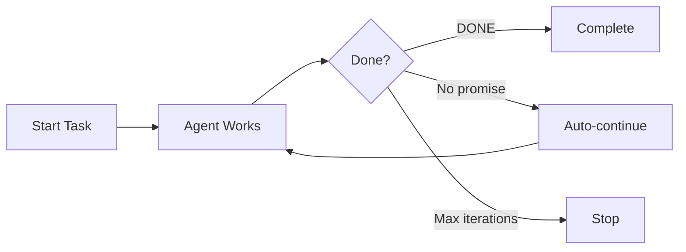

## What are Slash Commands?

Slash commands are **predefined workflows** triggered by typing `/command-name`. They provide quick access to common patterns and complex operations.

<Tip>
Think of slash commands as keyboard shortcuts for AI workflows.
</Tip>

## Built-in Commands

### /init-deep

**Purpose:** Generate hierarchical AGENTS.md files throughout your project

**Usage:**
```bash
/init-deep                      # Update existing + create new
/init-deep --create-new         # Regenerate from scratch
/init-deep --max-depth=2        # Limit directory depth
```

**What it does:**

<Steps>
<Step title="Discovery (Parallel)">
Fires multiple explore agents immediately:
- Project structure analysis
- Entry point detection
- Convention discovery
- Anti-pattern finding
- Build/CI exploration
- Test pattern analysis

**Dynamic spawning** based on project scale:
```
100+ files → +1 agent per 100 files
10k+ lines → +1 agent per 10k lines
Depth ≥4    → +2 agents for deep exploration
10+ large files → +1 agent for complexity
```
</Step>

<Step title="Scoring">
Scores directories by complexity:
```typescript
Complexity Score = 
  file_count * 1.0 +
  total_lines * 0.01 +
  large_files * 2.0 +
  depth * 0.5
```

Threshold: Score > 50 gets AGENTS.md
</Step>

<Step title="Generation">
- Root AGENTS.md first (project-wide context)
- Subdirectories in parallel
- Deduplication and validation
</Step>
</Steps>

**Output:**
```
project/
├── AGENTS.md              # Project-wide context
├── src/
│   ├── AGENTS.md          # src-specific context
│   └── components/
│       └── AGENTS.md      # Component-specific context
```

<Note>
OpenCode 1.1.37+ has native AGENTS.md support. The hook auto-disables when native support is detected.
</Note>

### /ralph-loop

**Purpose:** Self-referential development loop that runs until task completion

**Named after:** Anthropic's Ralph Wiggum plugin

**Usage:**
```bash
/ralph-loop "Build a REST API with authentication"
/ralph-loop "Refactor payment module" --max-iterations=50
/ralph-loop "task" --completion-promise="FINISHED" --strategy=continue
```

**Options:**
- `--completion-promise=TEXT` (default: "DONE")
- `--max-iterations=N` (default: 100)
- `--strategy=reset|continue` (default: reset)

**Behavior:**



**Example:**
```bash
/ralph-loop "Implement user authentication with OAuth"

# Agent works...
# If agent stops without <promise>DONE</promise>:
# System injects: "Continue your previous work. You have not completed the task yet."

# Agent continues...
# Eventually outputs: <promise>DONE</promise>
# Loop exits
```

**State stored in:** `.sisyphus/ralph-loop.local.md`

**Cancel:**
```bash
/cancel-ralph
```

### /ulw-loop

**Purpose:** Ralph loop + ultrawork mode

**Usage:**
```bash
/ulw-loop "Implement and test the payment integration"
```

Combines:
- Ralph's persistence (loops until done)
- Ultrawork's intensity (parallel agents, aggressive exploration)

### /refactor

**Purpose:** Intelligent refactoring with full toolchain

**Usage:**
```bash
/refactor <target> [--scope=<file|module|project>] [--strategy=<safe|aggressive>]
```

**Example:**
```bash
/refactor AuthService --scope=module --strategy=safe
```

**Features:**
- **LSP-powered** rename and navigation
- **AST-grep** for pattern matching
- **Architecture analysis** before changes
- **TDD verification** after changes
- **Codemap generation** for understanding

**Workflow:**

<Steps>
<Step title="Analysis">
- Generate codemap of target
- Find all references (LSP)
- Analyze architectural impact
</Step>

<Step title="Plan">
- Identify refactoring steps
- Order by dependency
- Define verification points
</Step>

<Step title="Execute">
- Make changes incrementally
- Verify after each step (LSP diagnostics)
- Run tests continuously
</Step>

<Step title="Verify">
- All tests pass
- No new errors/warnings
- Behavior preserved
</Step>
</Steps>

### /start-work

**Purpose:** Start Sisyphus work session from Prometheus plan

**Usage:**
```bash
/start-work [plan-name]
```

**What it does:**

<Tabs>
<Tab title="First Execution">

**Checks:**
```
.sisyphus/boulder.json exists?
  NO → INIT MODE
```

**Actions:**
1. Find most recent plan in `.sisyphus/plans/`
2. Create `boulder.json` tracking this plan
3. Switch session agent to Atlas
4. Begin execution from task 1

</Tab>

<Tab title="Resume Execution">

**Checks:**
```
.sisyphus/boulder.json exists?
  YES → RESUME MODE
```

**Actions:**
1. Read existing boulder state
2. Calculate progress (checked vs unchecked boxes)
3. Inject continuation prompt with remaining tasks
4. Atlas continues where it left off

**Example:**
```
Monday 9:00 AM
  /start-work
  Atlas: Task 1 complete, Task 2 in progress...
  [Session ends]

Monday 2:00 PM (NEW SESSION)
  /start-work
  "Resuming 'Build Auth' - 3 of 8 tasks complete"
  Atlas: Continuing from Task 3...
```

</Tab>
</Tabs>

**Boulder state** (`.sisyphus/boulder.json`):
```json
{
  "active_plan": ".sisyphus/plans/auth-refactor.md",
  "session_ids": ["abc123", "def456"],
  "started_at": "2026-03-01T09:00:00Z",
  "plan_name": "Auth Refactor"
}
```

### /stop-continuation

**Purpose:** Stop all continuation mechanisms for this session

**Usage:**
```bash
/stop-continuation
```

**Stops:**
- Ralph loop
- Todo continuation enforcer
- Boulder state (work session)
- Background agent spawning

**Use when:** You want the agent to stop its current multi-step workflow.

### /handoff

**Purpose:** Create detailed context summary for continuing work in a new session

**Usage:**
```bash
/handoff
```

**Generates:**
```markdown
# Handoff Document

## Current State
- What was being worked on
- Progress made
- Current blockers

## What Was Done
- Completed tasks with file paths
- Decisions made
- Patterns established

## What Remains
- Incomplete tasks
- Known issues
- Next steps

## Relevant Files
- File paths and their roles
- Modified files
- Dependencies

## Context for Next Session
- Important considerations
- Things to avoid
- Recommended approach
```

**Use when:** Ending a session but work isn't complete.

## Creating Custom Commands

Commands are loaded from these locations (priority order):

1. `.opencode/command/*.md` (project, OpenCode native)
2. `~/.config/opencode/command/*.md` (user, OpenCode native)
3. `.claude/commands/*.md` (project, Claude Code compat)
4. `~/.config/opencode/commands/*.md` (user, Claude Code compat)

### Basic Command

**File:** `.opencode/command/deploy.md`

```markdown
# /deploy

Deploy the application to production.

## Workflow

1. Run tests
2. Check for uncommitted changes
3. Build production bundle
4. Deploy to staging first
5. Verify staging
6. Deploy to production
7. Verify production
8. Tag release

## Safety Checks

- All tests must pass
- No uncommitted changes
- No linting errors
- Staging verification required before prod

## Commands

```bash
npm run test
npm run build
npm run deploy:staging
npm run deploy:production
git tag v$(date +%Y%m%d)-$(git rev-parse --short HEAD)
git push --tags
```
```

**Usage:**
```bash
/deploy
```

### Command with Arguments

**File:** `.opencode/command/release.md`

```markdown
# /release

Create a new release with changelog.

## Usage

```bash
/release <version> [--type=major|minor|patch]
```

## Workflow

1. Parse version from argument
2. Generate changelog from git commits since last tag
3. Update package.json version
4. Create git tag
5. Push to remote
6. Create GitHub release

## Changelog Generation

Group commits by type:
- `feat:` → Features
- `fix:` → Bug Fixes
- `chore:` → Chores
- `docs:` → Documentation

Format:
```markdown
## v{VERSION} ({DATE})

### Features
- Description from commit message

### Bug Fixes
- Description from commit message
```
```

**Usage:**
```bash
/release 2.1.0 --type=minor
```

### Command with Prompts

**File:** `.opencode/command/scaffold.md`

```markdown
# /scaffold

Scaffold a new feature with tests and documentation.

## Interactive Prompts

Ask the user:
1. Feature name (PascalCase)
2. Feature type (service|component|utility)
3. Include tests? (y/n)
4. Include Storybook? (y/n, only for components)

## File Generation

Based on type:

### Service
```
src/services/
  {FeatureName}Service.ts
  {FeatureName}Service.test.ts
  index.ts (export)
```

### Component
```
src/components/
  {FeatureName}/
    {FeatureName}.tsx
    {FeatureName}.test.tsx
    {FeatureName}.stories.tsx (if Storybook)
    {FeatureName}.module.css
    index.ts (export)
```

### Utility
```
src/utils/
  {featureName}.ts
  {featureName}.test.ts
  index.ts (export)
```

## Templates

Use project-specific templates from `.templates/` if they exist,
otherwise use sensible defaults matching project conventions.
```

**Usage:**
```bash
/scaffold
# Agent asks questions interactively
```

## Configuration

### Disable Built-in Commands

```json
{
  "disabled_commands": ["init-deep", "ralph-loop"]
}
```

### Auto-detection

The `auto-slash-command` hook automatically detects command-like messages:

```
User: /deploy to staging
→ Triggers /deploy command

User: Can you /refactor the auth service?
→ Triggers /refactor command
```

Disable auto-detection:
```json
{
  "disabled_hooks": ["auto-slash-command"]
}
```

## Real-World Examples

### Example 1: Code Review Command

**File:** `.opencode/command/review.md`

```markdown
# /review

Comprehensive code review of staged changes.

## Review Levels

1. **Correctness**: Logic, edge cases, error handling
2. **Quality**: Readability, maintainability, tests
3. **Architecture**: SOLID, patterns, separation of concerns
4. **Security**: Vulnerabilities, auth, data validation

## Process

```bash
# Get staged changes
git diff --staged

# For each changed file:
# 1. Load skill: code-review
# 2. Analyze using Oracle agent
# 3. Generate report
```

## Output Format

### ✅ Approved
- Strengths
- Minor suggestions

### ⚠️ Needs Changes
- Required changes with locations
- Explanations

### ❌ Requires Major Revision
- Critical issues
- Recommended approach
```

### Example 2: Performance Audit Command

**File:** `.opencode/command/perf-audit.md`

```markdown
# /perf-audit

Performance audit of the application.

## Audit Areas

### 1. Bundle Size
```bash
npm run build
du -sh dist/
npx source-map-explorer dist/**/*.js
```

### 2. Lighthouse Scores
```bash
npx lighthouse https://localhost:3000 \
  --output=json \
  --output-path=./lighthouse-report.json
```

Targets:
- Performance: >90
- Accessibility: >95
- Best Practices: >95
- SEO: >90

### 3. Core Web Vitals
- LCP {`<`}2.5s
- FID {`<`}100ms
- CLS {`<`}0.1

### 4. Code Analysis
Find:
- Large dependencies (>100kb)
- Duplicate code
- Unused exports
- N+1 queries

## Report Generation

Create markdown report with:
- Current scores
- Issues found (severity + location)
- Recommended fixes
- Estimated impact
```

### Example 3: Database Backup Command

**File:** `.opencode/command/db-backup.md`

```markdown
# /db-backup

Create database backup with verification.

## Safety Protocol

1. **Pre-check**:
   - Disk space available (require 2x DB size)
   - No running migrations
   - No critical operations in progress

2. **Backup**:
   ```bash
   timestamp=$(date +%Y%m%d_%H%M%S)
   pg_dump -Fc production_db > backups/backup_${timestamp}.dump
   ```

3. **Verify**:
   ```bash
   # Test restore to temp database
   createdb temp_verify_${timestamp}
   pg_restore -d temp_verify_${timestamp} backups/backup_${timestamp}.dump
   
   # Run integrity checks
   psql temp_verify_${timestamp} -c "SELECT COUNT(*) FROM users;"
   
   # Drop temp db
   dropdb temp_verify_${timestamp}
   ```

4. **Upload**:
   ```bash
   # Encrypt and upload to S3
   gpg --encrypt --recipient backup@company.com backups/backup_${timestamp}.dump
   aws s3 cp backups/backup_${timestamp}.dump.gpg s3://company-backups/db/
   ```

5. **Cleanup**:
   - Keep last 7 daily backups
   - Keep last 4 weekly backups
   - Keep last 12 monthly backups

## Verification Report

- Backup size
- Row counts by table
- Verification status
- Upload location
- Retention status
```

## Tips for Effective Commands

<CardGroup cols={2}>
<Card title="Single responsibility" icon="bullseye">
Each command should do ONE thing well
</Card>

<Card title="Idempotent" icon="rotate">
Safe to run multiple times
</Card>

<Card title="Fail-safe" icon="shield">
Check preconditions before destructive operations
</Card>

<Card title="Informative" icon="info">
Output what's happening at each step
</Card>
</CardGroup>

## Common Patterns

### Pattern 1: Multi-Stage Pipeline

```markdown
# /release-pipeline

## Stages

1. ✅ **Validation** (fail fast)
   - Tests pass
   - No uncommitted changes
   - Version incremented

2. 📝 **Changelog** (auto-generate)
   - Parse git commits
   - Group by type
   - Format markdown

3. 📦 **Build** (production bundle)
   - Clean build
   - Bundle optimization
   - Size report

4. 🚀 **Deploy** (staging first)
   - Deploy to staging
   - Run smoke tests
   - Deploy to production

5. 🏷️ **Tag** (git + GitHub)
   - Create git tag
   - Push to remote
   - Create GitHub release
```

### Pattern 2: Interactive Workflow

```markdown
# /migrate

## Interactive Steps

1. Ask: "Migration name?"
2. Ask: "Migration type? (schema|data|both)"
3. Generate migration files
4. Ask: "Review generated files?"
5. If approved, ask: "Run migration now?"
6. If yes, execute migration
7. Ask: "Test rollback?"
8. If yes, rollback and reapply
```

### Pattern 3: Conditional Logic

```markdown
# /deploy

## Conditional Workflow

```bash
if [tests fail]; then
  STOP - Fix tests first
fi

if [uncommitted changes]; then
  ASK - Commit or stash?
fi

if [staging not verified]; then
  DEPLOY staging first
  RUN smoke tests
  WAIT for approval
fi

DEPLOY production
VERIFY production
```
```

## Related

<CardGroup cols={2}>
<Card title="Skills" icon="wand-magic-sparkles" href="/guides/skills">
Domain-specific knowledge for commands
</Card>

<Card title="Ultrawork Mode" icon="bolt" href="/guides/ultrawork-mode">
Combine commands with ultrawork
</Card>

<Card title="Prometheus Planning" icon="map" href="/guides/prometheus-planning">
Use /start-work after planning
</Card>

<Card title="Configuration" icon="gear" href="/configuration/commands">
Full commands configuration
</Card>
</CardGroup>
