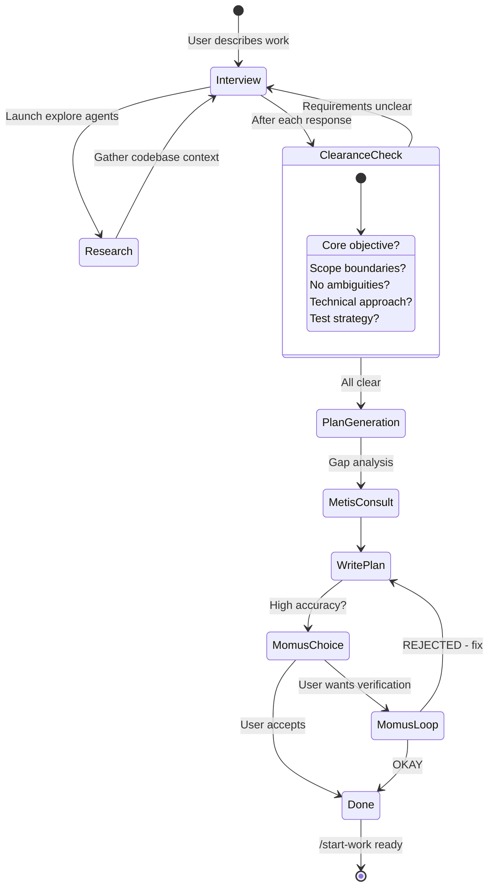

## What is Prometheus?

Prometheus is an intelligent planning agent that helps you think through complex work via an interactive interview process. It's **read-only**—can only create or modify markdown files within `.sisyphus/`.

<Tip>
Think of Prometheus as a strategic consultant who helps you articulate exactly what you need before anyone starts building.
</Tip>

## Why Use Prometheus?

| Scenario | Without Prometheus | With Prometheus |
|----------|-------------------|------------------|
| **Scope creep** | Agent adds unasked features | Clear boundaries defined upfront |
| **Missing edge cases** | Discovered during implementation | Identified in planning phase |
| **Unclear requirements** | Agent guesses, gets it wrong | Interviewing clarifies intent |
| **Wasted work** | Build wrong thing, start over | Build right thing first time |

## Quick Start

<Steps>
<Step title="Invoke Prometheus">
**Method 1:** Switch agent (Tab → Select Prometheus)

**Method 2:** Use `@plan` command (stays in current session)

```bash
@plan "Refactor the authentication system to support OAuth"
```
</Step>

<Step title="Answer interview questions">
Prometheus will ask clarifying questions:

```
Prometheus: What providers should OAuth support? (Google, GitHub, etc.)

Prometheus: Should existing password auth remain available?

Prometheus: Are there specific security requirements?
```

Answer thoroughly. Prometheus uses your answers to build the plan.
</Step>

<Step title="Review generated plan">
Plan is saved to `.sisyphus/plans/{name}.md`

```markdown
# OAuth Authentication Refactor

## Objective
Add OAuth 2.0 support while maintaining existing password auth...

## Scope
IN SCOPE:
- Google OAuth integration
- GitHub OAuth integration
- User account linking

OUT OF SCOPE:
- Social provider APIs beyond auth
- Migration of existing accounts

## Implementation Plan
...
```
</Step>

<Step title="Execute plan">
```bash
/start-work
```

Atlas reads the plan and executes systematically.
</Step>
</Steps>

## How Prometheus Works

### The Interview Process



### Intent-Specific Strategies

Prometheus adapts questions based on what you're doing:

<Tabs>
<Tab title="Refactoring">

**Focus:** Safety and behavior preservation

**Questions:**
- What tests verify current behavior?
- What must NOT change?
- Rollback strategy if issues arise?
- Performance requirements?

**Plan emphasis:**
- Behavior preservation checkpoints
- Incremental refactoring steps
- Verification after each step

</Tab>

<Tab title="Build from Scratch">

**Focus:** Discovery of existing patterns

**Questions:**
- Found pattern X in codebase—follow it or deviate?
- What conventions exist for this type of feature?
- Dependencies on existing systems?

**Plan emphasis:**
- Pattern adherence
- Integration points
- Consistency with codebase

</Tab>

<Tab title="Mid-sized Task">

**Focus:** Exact boundaries

**Questions:**
- What must NOT be included?
- Hard constraints?
- Success criteria?
- Edge cases to handle?

**Plan emphasis:**
- Clear scope definition
- Explicit out-of-scope list
- Measurable acceptance criteria

</Tab>

<Tab title="Architecture">

**Focus:** Long-term impact

**Questions:**
- Expected lifespan of this system?
- Scale requirements (users, data, traffic)?
- Future extensibility needs?
- Migration path from current state?

**Plan emphasis:**
- Architectural decisions
- Scalability considerations
- Extension points

</Tab>
</Tabs>

## The Three Agents

### Prometheus (Planner)

**Model:** Claude Opus 4.6 (with extended thinking)  
**Role:** Strategic consultant and interviewer

**Capabilities:**
- Launches explore/librarian agents to gather context
- Asks clarifying questions iteratively
- Detects when requirements are sufficiently clear
- Generates structured implementation plans

**Restrictions:**
- **Read-only** outside `.sisyphus/` directory
- Can only create/modify `.md` files in `.sisyphus/plans/`
- Cannot execute code or make changes

### Metis (Plan Consultant)

**Model:** Claude Opus 4.6  
**Role:** Gap analyzer and critic

**Called automatically** before Prometheus writes the final plan.

**What Metis checks:**
- Hidden intentions in user's request
- Ambiguities that could derail implementation
- AI failure patterns (over-engineering, scope creep)
- Missing acceptance criteria
- Edge cases not addressed

**Why Metis exists:**
> The plan author (Prometheus) has "ADHD working memory"—it makes connections that never make it onto the page. Metis forces externalization of implicit knowledge.

### Momus (Plan Reviewer)

**Model:** GPT-5.2  
**Role:** Ruthless reviewer for high-accuracy mode

**Activated when user opts into high-accuracy mode.**

**Momus only says "OKAY" when:**
- 100% of file references verified
- ≥80% of tasks have clear reference sources
- ≥90% of tasks have concrete acceptance criteria
- Zero tasks require assumptions about business logic
- Zero critical red flags

**If REJECTED:**
Prometheus fixes issues and resubmits. No maximum retry limit.

<Warning>
Momus is strict. High-accuracy mode takes longer but produces battle-tested plans.
</Warning>

## Using Prometheus

### Method 1: Switch Agent

<Steps>
<Step title="Switch to Prometheus">
Press **Tab** at the prompt

Select **"Prometheus"** from agent list
</Step>

<Step title="Describe your work">
```
I want to refactor the auth system to support OAuth providers
```
</Step>

<Step title="Answer questions">
Prometheus interviews you to clarify requirements
</Step>

<Step title="Plan is generated">
Saved to `.sisyphus/plans/{name}.md`
</Step>
</Steps>

### Method 2: Use @plan Command

Stay in current session (usually Sisyphus):

```bash
@plan "Implement rate limiting for all API endpoints"
```

The `@plan` command automatically switches context to Prometheus, runs the planning flow, then returns.

### Which Method?

| Use Case | Recommended |
|----------|-------------|
| New session, starting fresh | Switch to Prometheus agent |
| Already mid-work | Use `@plan` command |
| Want explicit control | Switch to Prometheus agent |
| Quick planning interrupt | Use `@plan` command |

<Note>
Both methods trigger identical planning behavior. Use whichever feels natural.
</Note>

## Plan Structure

Prometheus-generated plans follow a consistent structure:

```markdown
---
generated: 2026-03-01
agent: prometheus
status: ready
---

# {Plan Title}

## Objective
Clear, measurable goal statement

## Background
Context: why this work, what led to it, current state

## Scope
### IN SCOPE
- Specific deliverable 1
- Specific deliverable 2

### OUT OF SCOPE
- Thing we explicitly won't do
- Future work deferred

## Requirements
### Functional
- Requirement 1 with acceptance criteria
- Requirement 2 with acceptance criteria

### Non-Functional
- Performance targets
- Security requirements
- Compatibility requirements

## Implementation Plan
### Phase 1: {Name}
**Goal:** What this phase achieves

**Tasks:**
1. **Task name** [`file/path.ts:123`]
   - Specific action
   - How to verify
   - References to existing patterns

### Phase 2: {Name}
...

## Testing Strategy
- Unit test coverage requirements
- Integration test scenarios
- Manual verification steps

## Verification Checklist
- [ ] All acceptance criteria met
- [ ] Tests pass
- [ ] No new lint/type errors
- [ ] Documentation updated

## Risks and Mitigations
| Risk | Impact | Mitigation |
|------|--------|------------|

## Reference Materials
- Link to relevant docs
- Existing implementation patterns
- External resources
```

## High Accuracy Mode

For critical work, enable Momus review:

<Steps>
<Step title="Generate plan normally">
Complete the Prometheus interview process
</Step>

<Step title="Request high accuracy">
When Prometheus presents the plan:

```
User: Use high accuracy mode
```

or

```
User: Have Momus review this
```
</Step>

<Step title="Momus review loop">
Momus validates against strict criteria:

**OKAY** → Plan approved, ready to execute  
**REJECTED** → Prometheus fixes issues and resubmits

```
Momus: REJECTED

Issues found:
1. Task 3 lacks file reference - which file contains the auth middleware?
2. Phase 2 acceptance criteria too vague - what specifically validates "working"?
3. Missing edge case: what happens if OAuth provider is down?

Resubmit after addressing these issues.
```
</Step>

<Step title="Iterate until OKAY">
Prometheus fixes issues, Momus reviews again. Continues until approval.
</Step>
</Steps>

<Tip>
High accuracy mode is slower but produces plans that rarely need revision during execution.
</Tip>

## Executing Plans: /start-work

### What /start-work Does

<Steps>
<Step title="Checks for existing work">
```bash
.sisyphus/boulder.json exists?
  YES → Resume existing plan
  NO  → Start new plan
```
</Step>

<Step title="Finds the plan">
Uses most recent plan in `.sisyphus/plans/`
</Step>

<Step title="Switches to Atlas">
Atlas (the conductor) reads the plan
</Step>

<Step title="Executes systematically">
Atlas works through tasks, delegating to specialists
</Step>
</Steps>

### Session Continuity

**Boulder state** (`.sisyphus/boulder.json`) tracks:
- `active_plan`: Path to current plan file
- `session_ids`: All sessions working on this plan
- `started_at`: When work began
- `plan_name`: Human-readable identifier

**Example timeline:**

```
Monday 9:00 AM
  → @plan "Build user authentication"
  → Prometheus creates plan
  → /start-work
  → Atlas starts execution, creates boulder.json
  → Task 1 complete, Task 2 in progress...
  → [Session crashes]

Monday 2:00 PM (NEW SESSION)
  → User opens new session
  → /start-work
  → [Hook reads boulder.json]
  → "Resuming 'Build user authentication' - 3 of 8 tasks complete"
  → Atlas continues from Task 3
```

<Note>
No context is lost across sessions. Atlas picks up exactly where it left off.
</Note>

## Configuration

```json
{
  "sisyphus_agent": {
    "planner_enabled": true,      // Enable/disable Prometheus
    "replace_plan": true          // Demote default planner
  },
  
  "agents": {
    "prometheus": {
      "model": "anthropic/claude-opus-4-6",
      "thinking": {
        "type": "enabled",
        "budgetTokens": 32000       // Extended thinking for planning
      },
      "prompt_append": "Leverage deep & quick agents heavily, always in parallel."
    },
    
    "metis": {
      "model": "anthropic/claude-opus-4-6"
    },
    
    "momus": {
      "model": "openai/gpt-5.2"    // Different perspective from GPT
    }
  },
  
  "disabled_hooks": [
    // "prometheus-md-only"  // Remove write restrictions (not recommended)
  ]
}
```

## Real-World Examples

### Example 1: Complex Refactor

**Prompt:**
```
@plan "Migrate from REST to GraphQL while maintaining REST compatibility"
```

**Interview:**
```
Prometheus: Which endpoints should be migrated first? All at once or phased?
User: Phased. Start with user endpoints.

Prometheus: Should REST remain indefinitely or have a deprecation timeline?
User: Deprecation in 6 months, full removal in 12 months.

Prometheus: What GraphQL schema design patterns exist in the codebase?
User: None yet, this is the first GraphQL work.

Prometheus: [Launches explore agent to find similar projects]
```

**Generated plan:**
- Phase 1: GraphQL server setup
- Phase 2: User endpoint migration
- Phase 3: Parallel operation period (6mo)
- Phase 4: Deprecation warnings
- Phase 5: REST removal

Each phase has specific tasks, file references, and verification steps.

### Example 2: New Feature

**Prompt:**
```
@plan "Add real-time notifications with WebSockets"
```

**Interview:**
```
Prometheus: What events should trigger notifications?
User: New messages, mentions, system alerts.

Prometheus: Should notifications persist when user is offline?
User: Yes, store in database and send when they reconnect.

Prometheus: Found existing Redis pub/sub setup. Use that for broadcasting?
User: Yes, perfect.
```

**Generated plan:**
- WebSocket server setup (uses existing Redis)
- Event subscription system
- Offline notification storage
- Client reconnection handling
- Testing strategy for connection drops

### Example 3: Architecture Decision

**Prompt:**
```
@plan "Design caching layer for high-traffic API"
```

**Interview:**
```
Prometheus: Expected request volume?
User: 10k req/sec peak, 2k avg.

Prometheus: Read-heavy or write-heavy?
User: 90% reads, 10% writes.

Prometheus: Consistency requirements? Eventual consistency acceptable?
User: 5-second staleness acceptable for most data.

Prometheus: [Consults Oracle agent for architecture recommendations]
```

**Generated plan:**
- Redis cache layer (95% hit rate target)
- Cache invalidation strategy
- Fallback to database
- Monitoring and metrics
- Gradual rollout (10% → 50% → 100%)

## Troubleshooting

<AccordionGroup>
<Accordion title="Prometheus asks too many questions">
**Cause:** Requirements genuinely unclear.

**Solution:** Answer questions thoroughly. Prometheus stops when it has enough clarity. Or explicitly say:

```
I've provided enough detail. Generate the plan with what you have.
```
</Accordion>

<Accordion title="Plan references non-existent files">
**Cause:** Prometheus inferred incorrectly.

**Solution:** Enable high-accuracy mode:
```
Use high accuracy mode
```

Momus will catch and force correction of invalid references.
</Accordion>

<Accordion title="/start-work says 'no plan found'">
**Cause:** No plans in `.sisyphus/plans/` or boulder.json points elsewhere.

**Solution:**
```bash
# Create plan first
@plan "Your task description"

# Or delete stale boulder.json
rm .sisyphus/boulder.json
/start-work
```
</Accordion>

<Accordion title="Atlas not following the plan">
**Cause:** Plan may be too vague or missing context.

**Solution:** 
- Use high-accuracy mode next time
- Add more specific task descriptions
- Include file references for each task
- Provide examples of desired patterns
</Accordion>
</AccordionGroup>

## Tips for Best Results

<CardGroup cols={2}>
<Card title="Be specific about constraints" icon="ruler">
```
✅ "Must maintain <100ms response time"
❌ "Should be fast"
```
</Card>

<Card title="Mention existing patterns" icon="puzzle-piece">
```
✅ "Follow the pattern in src/services/user.ts"
❌ "Implement user service"
```
</Card>

<Card title="Define success clearly" icon="bullseye">
```
✅ "Success: All tests pass, no type errors, <5% perf regression"
❌ "Success: It works"
```
</Card>

<Card title="State what NOT to do" icon="ban">
```
✅ "Do NOT modify the existing API contracts"
❌ (Assume agent will figure it out)
```
</Card>
</CardGroup>

## Combining with Other Features

### Prometheus + Ultrawork

```bash
# Plan with Prometheus
@plan "Build admin dashboard with analytics"

# Execute with ultrawork intensity
/start-work
# Then type: ulw
```

Atlas reads the plan and uses ultrawork-style delegation automatically.

### Prometheus + Ralph Loop

For persistent execution:

```bash
@plan "Implement payment integration"
/ralph-loop "/start-work"
```

Ralph keeps pushing until the plan is fully executed.

## Related

<CardGroup cols={2}>
<Card title="Commands" icon="terminal" href="/guides/commands">
Learn about /start-work and other commands
</Card>

<Card title="Background Agents" icon="layer-group" href="/guides/background-agents">
How Atlas delegates work in parallel
</Card>

<Card title="Agent Model Matching" icon="microchip" href="/guides/agent-model-matching">
Why Prometheus uses Claude Opus
</Card>

<Card title="Ultrawork Mode" icon="bolt" href="/guides/ultrawork-mode">
Maximum intensity execution
</Card>
</CardGroup>
