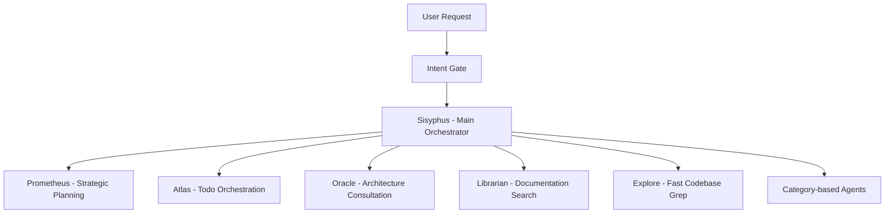

## What is Oh My OpenCode?

Oh My OpenCode is a multi-model agent orchestration harness for OpenCode. It transforms a single AI agent into a coordinated development team that actually ships code.

Not locked to Claude. Not locked to OpenAI. Not locked to anyone.

Just better results, cheaper models, real orchestration.

<CardGroup cols={2}>
  <Card
    title="Quick start"
    icon="bolt"
    href="/quickstart"
  >
    Get running with ultrawork in under 5 minutes
  </Card>
  <Card
    title="Installation"
    icon="download"
    href="/installation"
  >
    Complete setup with all providers and configuration
  </Card>
  <Card
    title="Core concepts"
    icon="book"
    href="/concepts/architecture"
  >
    Learn about agents, orchestration, and categories
  </Card>
  <Card
    title="Configuration"
    icon="gear"
    href="/configuration/overview"
  >
    Customize agents, models, and features
  </Card>
</CardGroup>

## The philosophy: breaking free

Anthropic wants you locked in. OpenAI wants you locked in. Everyone wants you locked in.

Oh My OpenCode doesn't play that game. It orchestrates across models, picking the right brain for the right job:

- **Claude** for orchestration
- **GPT** for deep reasoning  
- **Gemini** for frontend
- **Haiku** for quick tasks

All working together, automatically.

## How it works

Instead of one agent doing everything, Oh My OpenCode uses **specialized agents that delegate to each other** based on task type.

When Sisyphus delegates to a subagent, it doesn't pick a model name. It picks a **category**:

- `visual-engineering` — Frontend, UI/UX, design
- `deep` — Autonomous research + execution  
- `quick` — Single-file changes, typos
- `ultrabrain` — Hard logic, architecture decisions

The category automatically maps to the right model. You touch nothing.

## Key features

<CardGroup cols={2}>
  <Card title="Ultrawork mode" icon="wand-magic-sparkles">
    Type `ultrawork` or `ulw`. That's it. The agent handles everything — explores, researches, implements, verifies. Keeps working until done.
  </Card>
  
  <Card title="Parallel execution" icon="bars-staggered">
    Fire 5+ agents simultaneously. Research, implementation, and verification happening at once. Like having 5 engineers instead of 1.
  </Card>
  
  <Card title="Hash-anchored edits" icon="hashtag">
    `LINE#ID` content hashing validates every edit before applying. Grok Code Fast 1 went from 6.7% to 68.3% success rate just from this change.
  </Card>
  
  <Card title="Intent gate" icon="brain">
    Classifies your true intent before acting — research, implementation, investigation, fix. Fewer misinterpretations, better results.
  </Card>
  
  <Card title="LSP + AST tools" icon="code">
    Workspace-level rename, go-to-definition, find-references, pre-build diagnostics, AST-aware code rewrites. IDE precision for agents.
  </Card>
  
  <Card title="Skill-embedded MCPs" icon="plug">
    Each skill brings its own MCP servers, scoped to the task. Context window stays clean instead of bloating with every tool.
  </Card>
</CardGroup>

## Meet the agents

### Sisyphus: The discipline agent

Named after the Greek myth. He rolls the boulder every day. Never stops. Never gives up.

Sisyphus is your main orchestrator. Plans, delegates to specialists, and drives tasks to completion with aggressive parallel execution. **He doesn't stop halfway.**

<Note>
**Recommended models:** Claude Opus 4.6, Claude Sonnet 4.6, Kimi K2.5, GLM 5

Sisyphus has Claude-optimized prompts. No GPT prompt exists. Claude-family models work best.
</Note>

### Hephaestus: The legitimate craftsman

Named with intentional irony. Anthropic blocked OpenCode from using their API because of this project. So the team built an autonomous GPT-native agent instead.

Hephaestus runs on **GPT-5.3 Codex**. Give him a goal, not a recipe. He explores the codebase, researches patterns, and executes end-to-end without hand-holding.

<Warning>
**Requires GPT access.** Hephaestus is GPT-native. Claude cannot replicate this agent's behavior.
</Warning>

### Prometheus: The strategic planner

Prometheus interviews you like a real engineer. Asks clarifying questions. Identifies scope and ambiguities. Builds a detailed plan before a single line of code is touched.

Press **Tab** to enter Prometheus mode, or type `@plan "your task"` from Sisyphus.

### Supporting cast

- **Atlas** — Executes Prometheus plans, distributes tasks to specialized subagents
- **Oracle** — Read-only high-IQ consultant for architecture decisions  
- **Metis** — Gap analyzer, catches what Prometheus missed
- **Momus** — Ruthless reviewer, validates plans against clarity criteria
- **Explore** — Fast codebase grep using speed-focused models
- **Librarian** — Documentation and OSS code search
- **Multimodal Looker** — Vision and screenshot analysis

## What's next?

<CardGroup cols={2}>
  <Card
    title="Get started with ultrawork"
    icon="rocket"
    href="/quickstart"
  >
    Install and run your first ultrawork command in minutes
  </Card>
  <Card
    title="Complete installation"
    icon="download"
    href="/installation"
  >
    Full setup guide with all providers and authentication
  </Card>
  <Card
    title="Learn the architecture"
    icon="sitemap"
    href="/concepts/architecture"
  >
    Understand how agents collaborate and delegate
  </Card>
  <Card
    title="Read the manifesto"
    icon="book-open"
    href="/resources/manifesto"
  >
    Philosophy behind the project and why it exists
  </Card>
</CardGroup>
