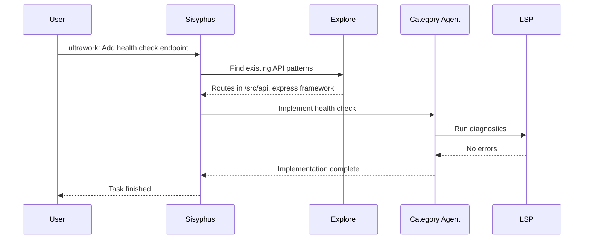

## Install Oh My OpenCode

The fastest way to get started is to let an AI agent handle the installation:

<Steps>
  <Step title="Paste this into your LLM agent">
    Copy this prompt to Claude Code, AmpCode, Cursor, or any LLM agent:

    ```text
    Install and configure oh-my-opencode by following the instructions here:
    https://raw.githubusercontent.com/code-yeongyu/oh-my-opencode/refs/heads/dev/docs/guide/installation.md
    ```

    <Tip>
    Seriously, let an agent do it. Humans fat-finger configs. The agent will ask about your subscriptions and configure everything automatically.
    </Tip>
  </Step>

  <Step title="Run the interactive installer (alternative)">
    If you prefer manual installation, run:

    <CodeGroup>
    ```bash Bun (recommended)
    bunx oh-my-opencode install
    ```

    ```bash npm
    npx oh-my-opencode install
    ```
    </CodeGroup>

    <Note>
    The CLI ships with standalone binaries for all major platforms:
    - macOS (ARM64, x64)
    - Linux (x64, ARM64, Alpine/musl)
    - Windows (x64)

    No runtime (Bun/Node.js) required after installation.
    </Note>
  </Step>

  <Step title="Configure your subscriptions">
    The installer will ask about your AI subscriptions:

    - **Claude Pro/Max** — Recommended for Sisyphus (main agent)
    - **ChatGPT Plus** — Enables GPT-5.2 for Oracle and GPT-5.3-codex for Hephaestus
    - **Gemini** — Great for visual/frontend tasks
    - **GitHub Copilot** — Fallback provider when native providers unavailable

    <Warning>
    **Sisyphus strongly recommends Claude Opus 4.6.** Using other models may result in significantly degraded experience.
    </Warning>
  </Step>

  <Step title="Authenticate providers">
    After installation, authenticate your chosen providers:

    ```bash
    opencode auth login
    ```

    Select your provider (Anthropic, Google, GitHub) and follow the OAuth flow.
  </Step>
</Steps>

## Your first ultrawork command

Once installed, navigate to any code project and run:

```bash
opencode
```

Then type:

```text
ultrawork: Add a health check endpoint to the API
```

That's it. Watch what happens:

<Steps>
  <Step title="Intent classification">
    The Intent Gate analyzes your request to understand the true goal — not just literal words.
  </Step>

  <Step title="Codebase exploration">
    Sisyphus spawns Explore agent to grep the codebase for existing API patterns, routes, and health check conventions.
  </Step>

  <Step title="Implementation">
    Based on discovered patterns, Sisyphus delegates to the right category agent:
    - `quick` category for simple endpoint addition
    - `ultrabrain` if complex business logic required
  </Step>

  <Step title="Verification">
    LSP diagnostics run automatically. Type errors? Fixed. Import issues? Resolved. Build errors? Addressed.
  </Step>

  <Step title="Completion">
    Todo enforcer ensures the agent doesn't stop until 100% complete. No halfway implementations.
  </Step>
</Steps>

<Tip>
You can type just `ulw` instead of `ultrawork`. It's an alias for the lazy (like all of us).
</Tip>

## What just happened?

Unlike single-model tools that process one thing at a time, Oh My OpenCode ran multiple agents in parallel:



This is **parallel execution**. While one agent writes code, another researches patterns, another checks documentation. Like having 5 engineers instead of 1.

## Two working modes

### Ultrawork mode: For the lazy

Just include `ultrawork` (or `ulw`) in your prompt:

```text
ultrawork: Refactor the auth module to use JWT tokens
```

The agent figures everything out. Explores, researches, implements, verifies. Keeps working until done.

This is the "just do it" mode. Full automatic.

### Prometheus mode: For the precise

Press **Tab** to enter Prometheus mode for complex multi-day tasks:

<Steps>
  <Step title="Interview phase">
    Prometheus asks clarifying questions like a real engineer:
    - What's the current authentication mechanism?
    - Should we support token refresh?
    - What's the expected token expiration time?
    - Do we need to migrate existing sessions?
  </Step>

  <Step title="Plan creation">
    Prometheus builds a detailed plan with:
    - Task breakdown with dependencies
    - Verification criteria for each step
    - Edge cases and error scenarios
    - Rollback strategy if needed
  </Step>

  <Step title="Execution">
    Run `/start-work` to activate Atlas:
    - Distributes tasks to specialized subagents
    - Tracks progress across sessions
    - Accumulates learnings (conventions discovered in task 1 passed to task 5)
    - Verifies each completion independently
  </Step>
</Steps>

<Tip>
Use Prometheus for:
- Multi-day projects
- Critical production changes
- Complex refactoring
- When you want a documented decision trail
</Tip>

## Common use cases

<AccordionGroup>
  <Accordion title="Fix all TypeScript errors in a large codebase">
    ```text
    ultrawork: Fix all TypeScript compilation errors
    ```

    Sisyphus will:
    1. Run `lsp_diagnostics` to get all errors
    2. Categorize errors by type (import issues, type mismatches, etc.)
    3. Delegate fixes to category agents in parallel
    4. Re-run diagnostics after each batch
    5. Continue until zero errors remain
  </Accordion>

  <Accordion title="Implement a new feature end-to-end">
    ```text
    ultrawork: Add user profile editing with avatar upload
    ```

    The agent will:
    1. Research existing user management patterns
    2. Design database schema changes if needed
    3. Implement backend API endpoints
    4. Create frontend UI components
    5. Add validation and error handling
    6. Write tests
    7. Update documentation
  </Accordion>

  <Accordion title="Refactor a module with confidence">
    Press **Tab** for Prometheus mode:

    ```text
    Refactor the payment processing module to support multiple payment providers
    ```

    Prometheus will interview you about:
    - Which providers to support initially
    - How to handle provider-specific features
    - Migration strategy for existing payments
    - Testing approach for each provider

    Then `/start-work` executes with full orchestration.
  </Accordion>

  <Accordion title="Understand an unfamiliar codebase">
    ```text
    @oracle Explain the authentication flow in this codebase
    ```

    Oracle (read-only consultant) will:
    1. Find auth-related files using LSP and grep
    2. Trace the flow from login to session management
    3. Identify security patterns and potential concerns
    4. Explain with code references (file:line format)
  </Accordion>
</AccordionGroup>

## Next steps

<CardGroup cols={2}>
  <Card
    title="Complete installation guide"
    icon="download"
    href="/installation"
  >
    Set up all providers, configure agents, and understand model matching
  </Card>
  <Card
    title="Learn about agents"
    icon="users"
    href="/concepts/agents"
  >
    Deep dive into Sisyphus, Hephaestus, Prometheus, and the supporting cast
  </Card>
  <Card
    title="Understand orchestration"
    icon="diagram-project"
    href="/concepts/orchestration"
  >
    How agents collaborate, delegate, and accumulate learnings
  </Card>
  <Card
    title="Customize configuration"
    icon="sliders"
    href="/configuration/overview"
  >
    Override models, disable features, and tune for your workflow
  </Card>
</CardGroup>
